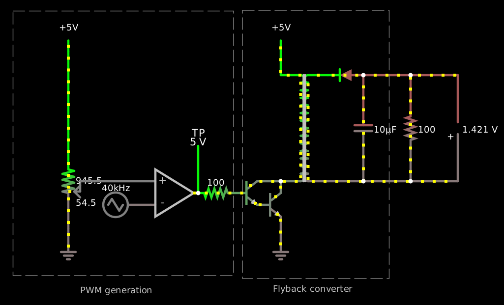
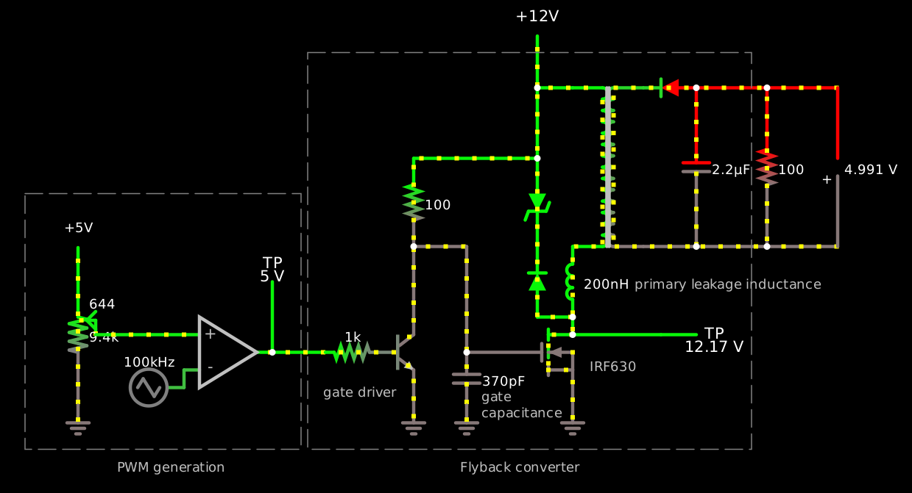

One thing I’ve been procrastinating on for years is building a proper
bench power supply.  Minimally it needs a galvanically isolated
single-ended DC output voltage adjustable from 0 V to 15 V with an
adjustable current limit of up to at least a few hundred milliamps,
some kind of readout that tells you what it’s delivering, and
precision of ±10% or better over most of that range.  Bipolarity
supplies, larger voltages, very precise regulation, linear regulation,
foldback current limiting, high efficiency, and thermal protection
would be nice but are less essential.

The standard design for this kind of thing involves a lot of analog
components, but computers are cheaper than transistors now, so it
might be better to use an analog circuit that’s as simple as possible
and pushes as much complexity as possible into software.

So ideally you’d like some kind of transformer-isolated switching
buck–boost converter.  Like [a flyback converter], which I’ve drawn
here being driven from a discrete-component PWM generation circuit
instead of a microcontroller:

    $ 1 1e-8 16.817414165184545 50 5 43 5e-11
    R 208 160 160 160 0 3 40000 2.5 2.5 0 0.5
    R 96 -48 96 -80 0 0 40 5 0 0 0.5
    a 208 144 272 144 9 5 0 1000000 0.027999984128133537 0.025000000000000005 100000
    174 96 192 112 64 1 1000 0.005 Resistance
    g 96 192 96 224 0 0
    w 112 128 208 128 0
    368 272 144 272 64 0 0
    t 320 144 352 144 0 1 -12.72087652079897 -0.20438741318712572 100 default
    r 272 144 320 144 0 100
    R 384 -16 384 -80 0 0 40 5 0 0 0.5
    T 384 128 448 -16 0 0.000004 1 -3.0191582567340447e-10 -0.12340456006778311 0.999
    d 496 -16 448 -16 2 1N5712
    c 496 -16 496 128 0 0.000009999999999999999 -0.40177526518551265 0.001
    w 496 128 448 128 0
    w 496 -16 560 -16 0
    w 496 128 560 128 0
    r 560 -16 560 128 0 100
    w 560 -16 624 -16 0
    w 560 128 624 128 0
    p 624 128 624 -16 1 0 0
    w 96 64 96 -48 0
    t 352 160 384 160 0 1 -12.516489107611845 0.2043871144711009 10 default
    w 384 144 384 128 0
    w 352 128 384 128 0
    g 384 176 384 224 0 0
    b 320 256 21 -103 0
    x 112 280 210 283 4 12 PWM\sgeneration
    b 332 -104 531 260 0
    x 373 278 481 281 4 12 Flyback\sconverter
    o 6 128 0 4099 10 6.4 0 2 6 3
    o 19 128 0 4098 20 0.1 0 1

[a flyback converter]: https://tinyurl.com/yzhw2r6e

The actual flyback converter itself is four components: an npn
darlington grounding one end of the primary of a transformer, a
schottky, and a capacitor.  Well, and a base resistor for the
darlington if the input signal is voltage-mode PWM instead of
current-mode PWM, so that’s five components.  (Horowitz & Hill suggest
a zener snubber across the primary to limit the voltage spike from the
primary leakage inductance: a rectifier and a TVS zener, in opposite
directions, so it’s more like seven.  But I didn’t simulate that.  In
their example the leakage inductance is about 5% of the total.)

Here’s the values I chose in the above simulation:

- a 5-volt supply;
- 40 kHz;
- a 100Ω base resistor;
- β=100 for the first transistor and β=10 for the second;
- a 1:1 transformer with a 4 μH primary inductance and a coupling coefficient of 0.999;
- a 1N5712 schottky with a forward voltage around 290 mV;
- a 10μF output smoothing cap;
- a 100Ω load.

With these values I get about:

- ±1% output ripple with a high output voltage, around 17 V and 170 mA
  (2.9 W);
- ±2% output ripple near the middle of the range, around 13 V and 130 mA,;
- ±1% output ripple near the bottom of the range (around 1.4 V and 14 mA);
- ±1% output ripple at the bottom of the range (0.5% duty cycle)
  (around 80 mV and 0.8 mA).

At the top of the range (99.5% duty cycle) the output voltage is
actually *lower* with this load.

It can drive thirstier loads like 10Ω at the cost of more ripple, for
example 260–330 mV (±6%) but then it tops out at around 2.5–3.2 V
(±6%), at which point it's pushing 300 mA (≈1 W).  So you’d probably
want a bigger output cap.  τ = 10Ω·10μF = 100 μs, and the PWM period
here is only 25 μs.

This design has a serious problem, though.  At high output voltages,
and especially when increasing the output voltage rapidly, the power
transistor sucks up a lot of power, like tens to hundreds of watts.
It seems that it’s not getting enough base current.  At one point, for
example, its Vce is 3.2 volts and its Ic is a rather alarming 33.6
amps, which wouldn’t be so bad if it had a nice saturated Vce of 0.2
volts or so, but noo, it’s forward active!  It’s “only” getting 3.4
amps of base current, you see, because the other transistor is *also*
forward active, because it’s only getting 33 mA of base current and so
it’s “only” passing 3.4 amps of Ic.  This is in part because both
transistors have a relatively high Vbe at this point of almost 900 mV,
reducing the voltage on the base resistor to only 3.3 V.

Reducing the base resistor value to 47 Ω helps a bit with the problem,
but that’s demanding a lot of current on the PWM input.  Even the
38 mA or so this circuit can demand is kind of a lot.  Really probably
what we need is an additional amplifier stage.  Also it’s probably
hard to find a transistor that can actually handle 3.4 amps of Ic but
has β=100.  A better alternative might be to use a pnp signal preamp
(β=100) to drive an npn power darlington (β=10 × β=10); that way we
avoid stacking more Vbes and can also use a beefy power transistor
there.  But using a power MOSFET, and maybe driving the whole circuit
from a 12-volt supply instead of 5 volts so it can use lower currents,
is maybe a better idea.

Doing the pnp-preamp thing driven from the PWM voltage input signal
through a 470-Ω base resistor does indeed help keep the switching
transistor's Vce from going above a volt or so, so it would
dramatically reduce the power-dissipation problems.  (It also inverts
the sense of the PWM signal.)

I think the transformer’s inductance imposes an inherent limit on the
power this circuit can deliver at a given frequency, which in this
simulation is about 3 watts, as we can see above.  The energy per
cycle is ½LI².  But what determines the maximum current?  It’s not
clear to me — the current’s derivative clearly is inversely
proportional to the inductance, but it need not fall to 0 each cycle.
Mindlessly banging on the simulator didn’t yield any ready answers;
altering the transformer inductance, PWM frequency, and transformer
coupling losses, even over orders of magnitude, didn’t get my output
voltage over 20 volts, although there are higher voltages floating
around the circuit, sometimes over 100 volts.  I said I only needed 15
volts, but I’d like to understand what the invisible limit is here.

OH, interesting — switching the diode model to a 1N4004 did the trick,
and now I can get 120V output.  Maybe the Schottky’s reverse leakage
was the limit!  Changing just the diode model gives us potentially
much higher output voltages, like over 100VDC, because now our reverse
leakage is like 18 nA instead of ...0.7 nA with the 1N5712?  No, that
can’t be it.

Oh, yes, it is — the simulation says that once it has about 20.8 volts
of reverse bias it starts passing 60 mA in reverse (or probably any
quantity at all, whatever’s needed to keep it from going below -21.)

So suppose you do build such a device; how do you regulate the output?
You need some way to measure the output voltage and current so you can
react to them.  One way to deal with this is to try to move those
analog quantities across the galvanic barrier, for example with analog
optocouplers or pulse transformers, putting the microcontroller on the
non-floating part of the circuit.  A different approach is to float
the microcontroller, although you probably don’t want to try to run
the microcontroller off 80 mV; you need a separate isolated power
supply for the microcontroller, probably using a separate transformer.
Then you can hook its analog inputs up directly to the output circuit
with relatively little fear, and use a single pulse transformer or
ordinary on/off optocoupler to transmit the information back over to
the non-isolated side.  That sounds simple!

Probably you’ll want a sense resistor, say 1Ω, one side of which is
connected to the microcontroller's ground.  At 300mA it would produce
300mV, which is a very reasonable amount to measure, about 25% of full
scale (256 counts) on an AVR’s 1.1V internal reference.  You’ll need
to divide down the actual output voltage, and maybe not suck more than
100μA into the bargain; if it’s 20V that means a 200kΩ divider, which
is pretty reasonable, and you can divide it down, say, with 220kΩ and
6.8kΩ.  Then 20V on the power supply output works out to 600mV on the
microcontroller’s input.  The smallest change you can reliably measure
with a raw AVR is probably about 5 mV, which works out to about 170 mV
at the output — not ideal but not terrible.  Multiple sensing ranges
attached to multiple input pins may be a good idea here.

The output doesn’t need to be regulated for a constant DC voltage.
With a center-tapped primary and an additional transistor switch, you
can generate an AC voltage on the output instead, with an arbitrary
waveform limited only by the PWM frequency.  (You could just use a
DC-blocking capacitor on the output, but then you could *only* use it
as an AC supply, instead of changing mode under software control.)

Here’s [a revised version][0] with 12V, 100kHz, leakage inductance
simulation and protection, a higher-breakdown Schottky, and a MOSFET
switch driven through an npn level-shifter:

    $ 1 3.0000000000000004e-9 2.008553692318767 46 5 43 5e-11
    R -96 112 -96 80 0 0 40 5 0 0 0.5
    a 0 192 80 192 9 5 0 1000000 2.986054403507636 4.678 100000
    174 -96 112 -96 224 1 10000 0.06440000000000001 Voltage knob
    w -80 176 0 176 0
    368 80 192 80 112 0 0
    R 320 -48 320 -112 0 0 40 12 0 0 0.5
    T 352 96 416 -48 0 0.000004 1 -2.3850875119357795e-7 6.800005003526621e-10 0.999
    34 power\sschottky 0 6.8e-10 12 1.003 150 0
    d 464 -48 416 -48 2 power\sschottky
    c 464 -48 464 96 0 0.0000022 -15.440326076997223 0.001
    w 464 96 416 96 0
    w 464 -48 528 -48 0
    w 464 96 528 96 0
    r 528 -48 528 96 0 100
    w 528 -48 592 -48 0
    w 528 96 592 96 0
    p 592 96 592 -48 1 0 0
    w 352 176 352 160 0
    w 320 160 352 160 0
    g 352 208 352 256 0 0
    x -61 300 37 303 4 12 PWM\sgeneration
    x 250 300 358 303 4 12 Flyback\sconverter
    l 352 160 352 96 0 2.0000000000000002e-7 -2.38508751092964e-7 0
    d 320 160 320 96 2 power\sschottky
    34 fwdrop\q0.806 1 1.7143528192810002e-7 0 2.0000000000000084 50 1
    z 320 16 320 96 2 fwdrop\q0.806
    w 320 16 320 -48 0
    w 80 192 128 192 0
    x 408 134 576 137 4 12 primary\sleakage\sinductance
    368 432 176 480 176 0 0
    w 352 176 432 176 0
    w 352 -48 320 -48 0
    t 176 192 208 192 0 1 0.6242259399470127 0.7204676364540711 100 default
    r 128 192 176 192 0 1000
    w 208 96 256 96 0
    w 256 96 256 192 0
    f 256 192 352 192 32 3 0.4
    r 208 16 208 96 0 100
    c 256 192 256 240 0 3.7e-10 0.09624169650705836 0.001
    g 256 240 256 256 0 0
    x 269 236 296 239 4 12 gate
    x 269 251 342 254 4 12 capacitance
    x 367 209 410 212 4 12 IRF630
    g 208 208 208 256 0 0
    x 126 232 192 235 4 12 gate\sdriver
    w 208 16 320 16 0
    w 208 96 208 176 0
    g -96 240 -96 256 0 0
    w 0 208 0 224 0
    R 0 224 -32 224 0 3 100000 2.5 2.5 0 0.5
    b -144 48 106 280 0
    b 112 -80 514 280 0
    o 4 128 0 4099 20 12.8 0 2 4 3
    o 15 128 0 4354 40 0.1 0 1
    o 27 32 0 4099 320 204.8 1 2 27 3
    o 34 32 7 xa1013 80 0.4 1 2 640 20 0 23 7 640 20 0

[0]: https://tinyurl.com/yfgumxxy

Pulling up the IRF630’s gate with a resistor makes it turn on somewhat
slowly, but this is not really important, because its drain current
ramps up slowly from zero anyway.  You could probably use a slower
resistor and save some power.  The strong npn pulldown slams it off
quickly, and that *may* be important, because when it turns off, it
may be carrying 15 amps!  However, the IRF630 doesn’t have excellent
on-resistance — even when fully turned on, at 15 amps, the ST
datasheet says its Vds is about 7 volts, about half an ohm.  Beefier
parts like the IRF540 would make that part of the circuit cooler, more
efficient, and perhaps more reliable; so too would a GaN part like the
EPC2036.

