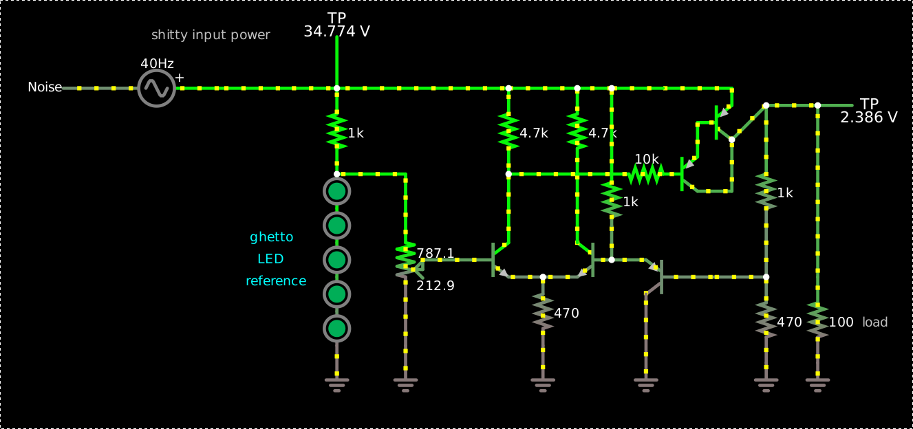
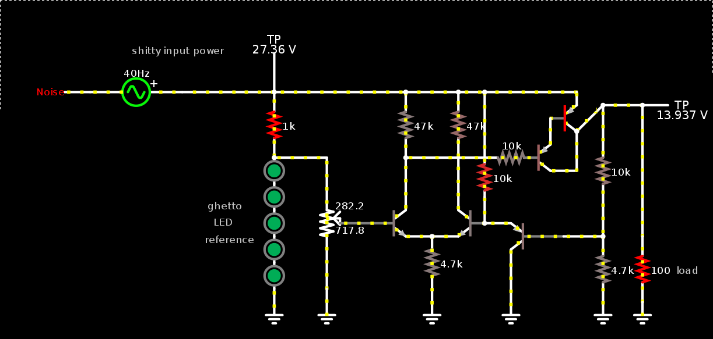
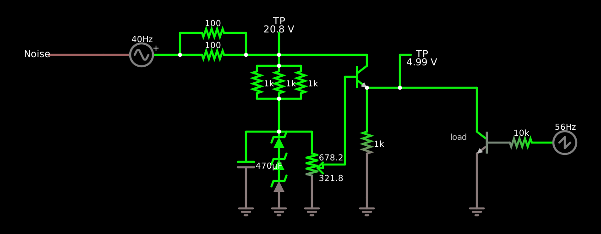

I designed [this ghetto linear regulator](https://tinyurl.com/y43n6q42):

    $ 1 0.0005 0.41233529972698213 50 5 43
    34 fwdrop\q1.7 1 9.32e-11 0.042 2.8457354689914074 0 1
    162 48 208 48 240 2 fwdrop\q1.7 0 1 0.5 0.1
    g 48 368 48 400 0 0
    r 48 208 48 128 0 1000
    162 48 240 48 272 2 fwdrop\q1.7 0 1 0.5 0.1
    162 48 272 48 304 2 fwdrop\q1.7 0 1 0.5 0.1
    162 48 304 48 336 2 fwdrop\q1.7 0 1 0.5 0.1
    162 48 336 48 368 2 fwdrop\q1.7 0 1 0.5 0.1
    w -64 128 48 128 0
    w 48 208 112 208 0
    174 112 368 128 208 1 1000 0.21290000000000003 Resistance
    g 112 368 112 400 0 0
    t 128 288 208 288 0 1 -30.2681886282526 0.561821870800069 100
    t 304 288 272 288 0 1 -23.47754064241586 0.6093418296786747 100
    w 208 304 240 304 0
    w 240 304 272 304 0
    r 240 304 240 368 0 470
    g 240 368 240 400 0 0
    w 208 272 208 208 0
    r 208 208 208 128 0 4700
    w 208 128 48 128 0
    r 272 208 272 128 0 4700
    w 272 128 208 128 0
    w 272 208 272 272 0
    w 304 128 272 128 0
    w 496 144 496 304 0
    r 496 304 496 384 0 100
    g 496 384 496 400 0 0
    r 448 144 448 304 0 1000
    r 448 304 448 384 0 470
    g 448 384 448 400 0 0
    w 304 288 304 256 0
    w 448 144 496 144 0
    368 496 144 544 144 0 0
    368 48 128 48 64 0 0
    w 208 208 320 208 0
    t 384 160 416 160 0 -1 29.966570072596046 -0.6789517017645963 100
    w 352 128 416 128 0
    w 416 128 416 144 0
    w 416 176 448 144 0
    t 352 208 384 208 0 -1 29.406988463009824 -0.5595816095862212 100
    w 384 192 384 160 0
    r 352 208 320 208 0 10000
    w 384 224 416 224 0
    w 416 176 416 224 0
    t 400 304 336 304 0 -1 0.8622748285616171 -0.684513215849966 100
    w 304 128 304 208 0
    r 304 208 304 256 0 1000
    w 304 288 336 288 0
    g 336 320 336 400 0 0
    w 400 304 448 304 0
    w 304 128 352 128 0
    v -176 128 -64 128 0 1 40 5 32 0 0.5
    R -176 128 -224 128 0 6 40 5 0 0 0.5
    x 537 350 562 353 4 12 load
    x -125 82 -14 85 4 12 shitty\sinput\spower
    x -33 271 7 274 4 12 ghetto
    x -26 291 -2 294 4 12 LED
    x -37 312 19 315 4 12 reference
    o 33 2 0 4355 80 51.2 0 2 33 3
    o 32 2 0 4355 20 12.8 1 2 32 3

The LED string at the left provides a constant-voltage reference
(though with a shitty temperature coefficient), the potentiometer to
the right divides it down to get the reference voltage for the
long-tailed pair in the middle which compares the voltage from the pot
reference with a feedback voltage from a PNP emitter follower to the
right, which buffers an unnecessarily hot voltage divider down from
the output. One of the outputs of the differential pair couples
through a 10k base resistor to a PNP darlington pass transistor that
regulates the output as such.

In this simulation it works really well.  The output is regulated very
closely (about 40 dB PSRR).  In real life it might not work that well.

[A slightly revised version](https://tinyurl.com/y23ssksn) runs the
control loop at much lower current, which should lead to less heat
problems, and works almost as well in simulation:

    $ 13 0.0005 0.41233529972698213 50 5 43
    34 fwdrop\q1.7 1 9.32e-11 0.042 2.8457354689914074 0 1
    162 48 208 48 240 2 fwdrop\q1.7 0 1 0.5 0.1
    g 48 368 48 400 0 0
    r 48 208 48 128 0 1000
    162 48 240 48 272 2 fwdrop\q1.7 0 1 0.5 0.1
    162 48 272 48 304 2 fwdrop\q1.7 0 1 0.5 0.1
    162 48 304 48 336 2 fwdrop\q1.7 0 1 0.5 0.1
    162 48 336 48 368 2 fwdrop\q1.7 0 1 0.5 0.1
    w -64 128 48 128 0
    w 48 208 112 208 0
    174 112 368 128 208 1 1000 0.7178000000000001 Resistance
    g 112 368 112 400 0 0
    t 128 288 208 288 0 1 -21.88050572375028 0.5151707707652369 100
    t 304 288 272 288 0 1 0.5709371172593585 0.601924362557102 100
    w 208 304 240 304 0
    w 240 304 272 304 0
    r 240 304 240 368 0 4700
    g 240 368 240 400 0 0
    w 208 272 208 208 0
    r 208 208 208 128 0 47000
    w 208 128 48 128 0
    r 272 208 272 128 0 47000
    w 272 128 208 128 0
    w 272 208 272 272 0
    w 304 128 272 128 0
    w 496 144 496 304 0
    r 496 304 496 384 0 100
    g 496 384 496 400 0 0
    r 448 144 448 304 0 10000
    r 448 304 448 384 0 4700
    g 448 384 448 400 0 0
    w 304 288 304 256 0
    w 448 144 496 144 0
    368 496 144 544 144 0 0
    368 48 128 48 64 0 0
    w 208 208 320 208 0
    t 384 160 416 160 0 -1 13.850113221994937 -0.7228391475035494 100
    w 352 128 416 128 0
    w 416 128 416 144 0
    w 416 176 448 144 0
    t 352 208 384 208 0 -1 13.246644166661381 -0.6034690553335551 100
    w 384 192 384 160 0
    r 352 208 320 208 0 10000
    w 384 224 416 224 0
    w 416 176 416 224 0
    t 400 304 336 304 0 -1 4.458376683019007 -0.6122710669745723 100
    w 304 128 304 208 0
    r 304 208 304 256 0 10000
    w 304 288 336 288 0
    g 336 320 336 400 0 0
    w 400 304 448 304 0
    w 304 128 352 128 0
    v -176 128 -64 128 0 1 40 5 32 0 0.5
    R -176 128 -224 128 0 6 40 5 0 0 0.5
    x 537 350 564 353 4 12 load
    x -125 82 -13 85 4 12 shitty\sinput\spower
    x -33 271 9 274 4 12 ghetto
    x -26 291 -3 294 4 12 LED
    x -37 312 24 315 4 12 reference
    o 33 2 0 4355 80 51.2 0 2 33 3
    o 32 2 0 4355 80 51.2 1 2 32 3

A caveman version using real zeners is [this
one](https://is.gd/dumblinreg) which will probably burn out a 1k pot:

    $ 1 0.0005 0.5754602676005731 50 5 43
    34 zener-6.1 1 1.7143528192810002e-7 0 2.0000000000000084 6.1 1
    z 48 304 48 272 2 zener-6.1
    g 48 304 48 320 0 0
    z 48 272 48 240 2 zener-6.1
    z 48 240 48 208 2 zener-6.1
    w 48 208 96 208 0
    174 96 208 96 304 1 1000 0.6782 Voltage adjustment knob
    g 96 304 96 320 0 0
    w 112 256 144 256 0
    w 144 256 144 128 0
    t 144 128 176 128 0 1 -20.9259922632883 0.7095174649350575 100
    r 176 144 176 304 0 1000
    g 176 304 176 320 0 0
    w 48 96 176 96 0
    w 176 96 176 112 0
    w 176 144 224 144 0
    c 0 208 0 304 0 0.00047000000000000004 18.35536628033426 0.001
    w 0 208 48 208 0
    g 0 304 0 320 0 0
    368 224 96 256 96 0 0
    R -208 96 -304 96 0 6 40 5 0 0 0.5
    v -208 96 -96 96 0 1 40 5 30 0 0.5
    368 48 96 48 48 0 0
    w 0 96 48 96 0
    r 0 64 -96 64 0 100
    w 224 96 224 144 0
    w 224 144 336 144 0
    t 384 224 336 224 0 1 -4.3103019007059675 0.7081563777938871 100
    w 336 208 336 144 0
    g 336 240 336 320 0 0
    r 384 224 416 224 0 10000
    R 416 224 464 224 0 4 56 5 5 0 0.5
    x 297 220 322 223 4 12 load
    w 48 96 48 112 0
    w 16 112 48 112 0
    w 48 112 80 112 0
    r 16 112 16 160 0 1000
    r 48 112 48 160 0 1000
    r 80 112 80 160 0 1000
    w 16 160 48 160 0
    w 48 160 80 160 0
    w 48 160 48 208 0
    w -96 64 -96 96 0
    w 0 96 0 64 0
    r 0 96 -96 96 0 100
    o 18 2 0 4355 20 12.8 0 2 18 3
    o 21 2 0 4355 40 51.2 1 2 21 3
    o 9 2 7 4098 40 0.1 2 1 5
    o 26 2 3 4359 10 0.1 3 1
