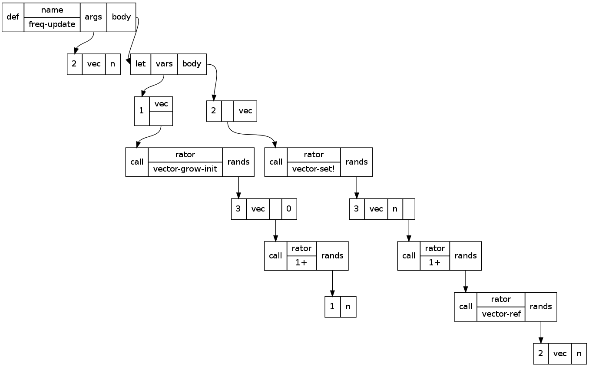

I skimmed [Bobrow’s 01966 “The Structure of a Lisp System using
Two-Level Storage”][0] yesterday, and I was struck by his claim that
BBN LISP was fast enough to be usable, even on an 18-bit PDP-1 with a
17–33 *milli*second drum memory (5–10 μs per word sequential read) and
a 16-kibiword core memory (5 μs per random word access), even for 2–3
concurrent users.  This is about half the speed of a Commodore 64 and
only 36 KiB of RAM, but the drum was 88 kibiwords and much faster than
a Commodore floppy.  I thought I’d go back and read it in greater
depth to see how this was possible.

[0]: https://apps.dtic.mil/dtic/tr/fulltext/u2/647601.pdf

Review of Bobrow’s paper
------------------------

He allocated 4 KiW of core to compiled code (mostly in a 3400-word
“ring buffer”), 4 KiW to the system (“supervisor and permanent code”,
divided into six overlays), and the other 8 KiW to the stack and heap,
and used two-word CONS cells.  When paging a 256-word page of compiled
Lisp in from the drum, the system linked it.

It seems like the system could manage at most some 6000 calls per
second:

> Closed subroutine references to an in-core word through the [virtual
> memory page] map takes approximately 170 microseconds (because of
> the poor set of operation codes on the machine, and the lack of an
> index register).

This seems to have been the paper that first published shallow binding
(though in a strange way that uses pointers into the call stack),
tagged pointers for small integers (“offset by 300,000 octal”, both
positive and negative), CDR-coding, and a form of BIBOP typing.  Of
these I thought CDR-coding was the most interesting.

The primary objective of the BIBOP typing was to avoid having to reach
out to the drum for type tests, especially for symbols (where both of
the usual predicates can be answered without waiting for a drum
reference, namely ATOM and EQ) and so a contiguous chunk of the 17-bit
(!)  virtual address space was assigned to almost every type: value
cells† starting at 0o150_000, property list cells†, full words (large
integers), pushdown list (the call stack) starting at 0o200_000,
function cells†, print-name pointers†, print-names, and “hash table”,
which last runs from 0o270_000 (0x17000) to 0o300_000, although all of
this this seems to conflict with the earlier statement that small ints
from -32767 to +32767 were offset by 0o300_000, which would have them
occupy the “address space” from 0o200_000 to 0o400_000.  The virtual
addresses from 0o10_000 to 0o150_000 are shared between “list
structure” (shown growing down) and “compiled code” (shown growing
up); although I have no idea how you would then distinguish a code
pointer from a CONS, perhaps code pointers as such weren’t first-class
values.

(A secondary benefit not mentioned is that CONS cells occupied two
words instead of three, because they don’t need a type tag.)

He says this static allocation is preferred to “provid[ing] an in-core
map of storage areas” because it reduces resident memory pressure (at
the expense of virtual memory space efficiency).  I suppose the 12 KiW
of physical core being used for paging amounts to 48 pages, which is
indeed pretty tight.  If you divided the 17-bit address space up to
0o400_000 into “storage areas” of 0o4_000 homogeneous words, your type
map would have 64 entries.  If you could get by with a 3-bit type code
for each “storage area”, you could squeeze 6 of them into each memory
word; 4 per word would require 16 words of memory for the BIBOP map.
They must have been pretty desperate to save 16 words of memory.  But
then, a static type allocation avoids writing code for dynamic
allocation, too.

Above there are four items marked with “†”; these are the four virtual
memory areas associated with symbols (“each literal atom”).  Each is
0o10_000 in size, so I guess the system supported a maximum of 4096
symbols, and these were in essence parallel arrays.  “A pointer to an
atom\* points to its value cell.”  They’re separated in virtual memory
because accesses to them tend to be not merely uncorrelated but
actually negatively correlated — symbols used for functions tend not
to be used for variables (“value cells”), almost nothing uses property
lists, and print-name pointers are not normally used during actual
computation.  4096 words is 16 256-word pages, so I guess you’d page
in a sixteenth of the symbols’ value cells or function cells or
whatever at a time.

\* They did also consider numbers to be “atoms”.

Aha, here’s the resolution to the dilemma above about overlapping
memory areas: although the call stack starts at 0o200_000, followed by
function cells, print-name pointers, print names, and the hash table,
none of these are first-class values!  If you want to refer to a
symbol, you point to its value cell, not its function cell or print
name, so it’s totally kosher to use the addresses at 0o200_000 and up
for small ints.  Moreover the sequence simplifies some other type
tests: anything over 0o150_000 was an “atom” (symbol or number), but
anything over 0o170_000 was an integer, and anything over 0o200_000
was a *small* integer.  So the boundaries were chosen with an eye to
subset relations.

The “CDR-coding” didn’t actually use less space; the CDR pointers were
still fully materialized!  It just attempted to maximize locality by
allocating `(cons x y)` on the first possible of `y`’s page, `x`’s
page, some page in core, or some swapped-out page.  This used a
per-page free list and an in-core map of per-page free lists, which I
suppose must have used 192 words (!!) for the 49152 words of virtual
memory available for “list structure”.

However, their “additional scheme for dumping onto secondary storage
(magnetic tape)” does maybe seem to have done the full CDR-coding
thing.  This is referenced to “Storage Management in LISP”, Bobrow, in
preparation, Proc. IFIP Conf. on Symbol Manipulation Languages, and “A
LISP Garbage Collector Algorithm Using Serial Secondary Storage”,
Minsky, AIM-58, 01963.

Prospects for microcontroller systems
-------------------------------------

An STM32F103C8 as used in a Blue Pill runs about 72 MIPS, 64 or
usually 128 KiB of Flash, and 20 KiB of SRAM; the preassembled board
costs about US$2.  This chip uses about 1.5 nJ per 32-bit instruction
and can run ARM code from SRAM.  But 20 KiB isn’t a lot of space, so
you need some external memory.

As mentioned in file `energy-autonomous-computing.md`, and file
`ghz-dds.md`, you can get a variety of memory chips to interface to
the STM32; a rough outline of chips I think may be representative
follows:

<table>
<tr><th>           <th>         <th>    <th colspan=2>read    <th colspan=2>write
<tr><th>           <th>type     <th>Cost<th>ns/byte<th>nJ/byte<th>ns/byte<th>nJ/byte<th>bytes<th>nUS$/byte<th>GPIOs needed
<tr><th>GD25D10C   <td>2SPI NOR <td>30¢ <td>50     <td>0.4    <td>27000  <td>1800   <td>512Ki<td>4600     <td>4? (SPI)
<tr><th>CY62136EV30<td>SRAM     <td>111¢<td>45     <td>6      <td>45     <td>6      <td>256Ki<td>4200     <td>25? (parallel)
<tr><th>23LC1024   <td>QSPI SRAM<td>210¢<td>100    <td>1      <td>100    <td>1      <td>128Ki<td>16000    <td>4? (SPI; 6 if QSPI)
<tr><th>S34MS01G2  <td>SLC NAND <td>100¢<td>45     <td>1.2    <td>160    <td>4.4    <td>128Mi<td>7.5      <td>15? (parallel NAND)
<tr><th>GD5F1GQ4   <td>QSPI NAND<td>250¢<td>56     <td>4      <td>220    <td>16     <td>128Mi<td>19       <td>4? (SPI; 6 if QSPI)
</table>

The parallel SRAM could actually be used in 16-bit-wide mode and get
double the bandwidth and half the power usage, but use 7–8 more GPIO
pins.

In theory it should be possible to gang up a bunch of SPI RAMs or SPI
flash memories (of the same type!) and read from them in parallel,
whether or not you can write to them in parallel.  This would allow
you to address them with a one-pin address bus.

NAND Flash must be read and written a page at a time — the two NAND
chips profiled above use a 2048-byte page size.  It’s very appealing
as a form of secondary storage, especially for frequently-written
data: the energy cost per byte written is lower than anything but a
(volatile!) SPI SRAM, and the dollar cost per byte of capacity is
about three orders of magnitude lower than the alternatives.  The
access latency doesn’t show up in the table, but it's on the order of
50–100 μs, which is nearly 1000 times slower than the 50–200 *n*s of
the other memory types, coincidentally almost precisely in inverse
proportion to the price per byte.

NAND also comes conveniently packaged with a ready-made FTL and SPI
interface in the form of SD cards and MicroSD cards, but I imagine
there might be power costs as well as the well-known reliability
problems introduced by shitty FTLs.

Writing frequently-read data to a NOR Flash might actually save power
as well, but this is an extreme measure: you'd have to read a given
byte from NOR instead of the 23LC1024 SRAM 3000 times before paying
for the cost of writing it into the NOR.

So, suppose we have a system consisting of an STM32F103C8
microcontroller, a 23LC1024 QSPI SRAM, and a GD5F1GQ4 QSPI NAND chip.
When idle it’s using 0.54 μA at 2.5 V in the MCU, 4 μA at 2.5 V in the
23LC1024, and 90 μA at 1.8 V in the NAND unless we turn it off with a
transistor — 162 μW for the Flash and another 11 μW for the rest of
the system.  A 2048-byte major page fault would initially take 114 μs
at 72 mW in the Flash, working out to 8200 nJ, and about 34 μs at, I
don't know, 20 mA and 2.5 V in the MCU, so 50 mW and another 1700 nJ,
total about 9900 nJ.  At that point it’s occupying one of the 10 page
slots in the MCU’s internal SRAM.  Evicting that page to the SRAM (you
might want to evict a subpage instead) would take another 200 μs and
10 000 nJ in the CPU, plus 2000 nJ in the SRAM, which brings up the
very interesting point that low-power SPI SRAM stops being so
low-power if it keeps the CPU busy longer!

A tiny QSPI controller like the Raspberry Pi Pico’s “pioasm”
coprocessors that allowed the CPU to page while continuing to compute
would be super helpful.  The STM32F103C8 does have a 7-channel DMA
controller which can run its two hardware SPI peripherals, so that
might actually be doable.  The SPI peripherals support dual SPI but
not quad SPI, so instead of 100 ns and 56 ns per byte, it would be
200 ns and 112 ns per byte, perhaps with correspondingly increased
power usage in the peripherals — but you could power down the CPU or
have it work on something else.  This might increase the cost of major
page faults to 16 μJ, with a latency of 150 μs, and decrease the cost
of minor ones to 4 μJ, with a latency of 400 μs.

Paging out a dirty page to NAND would also take about 400 μs.

At this rate you could do 2500 minor page faults (plus evictions and
pageouts) or 6700 major page faults per second, but the first would
cost 10 mW and the second would cost 110 mW.

(Uh, but actually these SPIs are only good up to 18 Mbit/s... maybe
parallel memory isn’t such a bad option?)

CDR-coding stacks
-----------------

What I originally thought when I skimmed Moses’s paper was that he was
going to CDR-code lists in something like the following fashion.  When
some datum z produced by (cons x y) is placed on a page different from
its cdr, it gets allocated a shortish buffer, with a counter and
length packed into a word at its beginning:

    |-----+---+---+---+---+---+---|
    | 2/7 | y | x | - | - | - | - |
    |-----+---+---+---+---+---+---|

If later we execute (let ((w (cons a z))) ...) the first thing we
check is to see whether there’s more space available in z’s buffer.
There is, so we stuff a into it:

    |-----+---+---+---+---+---+---|
    | 3/7 | y | x | a | - | - | - |
    |-----+---+---+---+---+---+---|

Now, if we later cons something else onto w, like b, we may well be
able to pack that into the same buffer:

    |-----+---+---+---+---+---+---|
    | 4/7 | y | x | a | b | - | - |
    |-----+---+---+---+---+---+---|

Eventually the buffer gets full, or we try to cons two things onto the
same thing, so then we allocate a new buffer, ideally on the same
page.  If the buffer got full we might want to allocate a bigger
buffer.

This is all assuming there’s some sensible way to represent and
dereference pointers into these buffers, and of course it would make
RPLACD (set-cdr!) quite tricky.

With a buffer size of 8 words, like the above, we can store 6 cons
cells in it, which would normally take 12 words, which is a best-case
savings of 33%; as the buffer size grows, this approaches 50%.  The
worst-case inflation for 8 words is 4× (300%) but most lists are
longer than that.  The break-even point is at 4-item lists.

A quick Scheme program to count the lengths of lists, applied to
itself, found 2 lists of length 0, 3 lists of length 1, 33 lists of
length 2, 22 lists of length 3, 12 lists of length 4, and one list of
length 5, which was the whole program and therefore possibly should
not be counted.  This is clearly not a fully representative sample of
the data structures Lisp programs manipulate but it’s probably true
that lists of length 2 and 3 are much more common than other lengths.
(Also, none of the lists were improper.)

So, possibly a more optimal solution would be to use an initial buffer
of size 4, and use a header bit to indicate whether the list is
NIL-terminated or improper (or continued elsewhere).  Then a 2-item
list would be 4 words, the break-even point:

    |---------+---+-------------+---+
    | NIL/2/3 | 1 | delete-char | - |
    |---------+---+-------------+---+

And a 3-item list would also be 4 words, a 33% saving over the
standard approach:

    |---------+-----+-----+--------------|
    | NIL/3/3 | end | beg | make-overlay |
    |---------+-----+-----+--------------|

If we initially allow such buffers (“obstacks”?  “arenas”?) to extend
to the end of their page, only capping them off at a bit over their
current capacity when we want to allocate something else, we can
reduce the number of spills.  For example, when parsing this Scheme
through recursive descent:

    (define (freq-update vec n)
      (let ((vec (vector-grow-init vec (1+ n) 0)))
        (vector-set! vec n (1+ (vector-ref vec n)))
        vec))

the first cons we do is of `vec` onto `'()`, creating a new buffer:

    |-----------+-----+-----
    | NIL/1/256 | vec | ... 
    |-----------+-----+-----

Then we start a totally new list by consing `n` onto `'()`, so we cap
off this one with a little room to grow and start a new one:

    |---------+-----+---+-----------+---+-----
    | NIL/1/2 | vec | - | NIL/1/252 | n | ... 
    |---------+-----+---+-----------+---+-----

Then we cons `vec` and `vector-ref` onto that:

    |---------+-----+---+-----------+---+-----+------------+-----
    | NIL/1/2 | vec | - | NIL/3/252 | n | vec | vector-ref | ... 
    |---------+-----+---+-----------+---+-----+------------+-----

Then we cap off that entire list and cons it onto `'()` followed by
`1+`:

    |---------+-----+---+---------+---+-----+------------+---+---+-----------+----+----+-----
    | NIL/1/2 | vec | - | NIL/3/5 | n | vec | vector-ref | - | - | NIL/2/246 | #6 | 1+ | ... 
    |---------+-----+---+---------+---+-----+------------+---+---+-----------+----+----+-----

So far we have 6 conses in 12 words, which is a singularly uninspiring
performance.

Alternative memory representations
----------------------------------

A maybe more interesting representation of the above S-expression
might annotate a flat list of atoms with their depths:

    (define (freq-update vec n) (let ((vec (vector-grow-init vec ...
        1         2       2  2    2     4           5         5

but of course this is not only just as many words of memory, it does
not contain enough information to reconstruct the S-expression!

An RPN approach to reconstructing it might intersperse a series of
N-ary operators on the symbol list:

    1+ vector-ref vec n 3! 2! vec 4!

which at least compresses the six conses above down to 7 words instead
of 12.  For functions of fixed arity the N-ary operators are, strictly
speaking, unnecessary, and you could imagine representing that
S-expression with the following whitespace-separated tokens:

    define( freq-update vec n ){
        let( vec vector-grow-init vec 1+ n 0 ){
            vector-set! vec n 1+ vector-ref vec n
            vec
        }
    }

That successfully represents the function code in 23 words, rather
than 28 conses and thus 56 words, but at the cost of pushing most of
the arity information into the symbols instead of the conses, which
makes it quite awkward to compute with.

In the particular case that what you want to represent is something
analogous to Scheme source code, a structier approach may work better,
using ML-like pattern-matching and constructors, but Golang-like
slices for things like argument lists.  That is, while you’re building
up an argument list, by all means use a cons list, but once you’re
done building it, freeze it into a counted array, which you can
comfortably cdr down with a slice.  So, for example, `let` here takes
some variable-initializer pairs and some body expressions, in this
case one of the first and two of the second; and a function call takes
a function expression and some number of argument expressions.

Here’s a thing that might look like in Graphviz:

    digraph x {
            node [shape=record]
            func [label="<head>def|{name|freq-update}|<args>args|<body>body"]
            func:args -> funcargs:head;
            funcargs [label="<head>2|vec|n"]
            func:body -> let:head;

            let [label="<head>let|<vars>vars|<body>body"];
            let:vars -> vars:head;
            vars [label="<head>1|{vec|<init1>}"];
            vars:init1 -> vecinit:head;
            vecinit [label="<head>call|{rator|vector-grow-init}|<rands>rands"];
            vecinit:rands -> vrands:head;
            vrands [label="<head>3|vec|<incn>|0"]
            vrands:incn -> incn:head;
            incn [label="<head>call|{rator|1+}|<rands>rands"];
            incn:rands -> incnrands:head;
            incnrands [label="<head>1|n"];

            let:body -> body:head;
            body [label="<head>2|<1>|vec"];
            body:1 -> x:head;
            x [label="<head>call|{rator|vector-set!}|<rands>rands"];
            x:rands -> y:head;
            y [label="<head>3|vec|n|<z>"];
            y:z -> z:head;
            z [label="<head>call|{rator|1+}|<rands>rands"];
            z:rands -> zz:head;
            zz [label="<head>call|{rator|vector-ref}|<rands>rands"];
            zz:rands-> zrands:head;
            zrands [label="<head>2|vec|n"];
    }

It looks better rendered with Graphviz dot, but Graph::Easy manages a
crude ASCII-art rendition which I’ve cleaned up here:

                       +-----------------------------------------------------------------------+
                       |                                                                       |
                       |   +------+--------+--------------+-------+------+     +-----+------+-------+                                                             +------+-----+----+
                       |   | def  |  name  | freq-update  |  args | body | --> | let | vars |  body |                                                             |  2   | vec |  n |
                       |   +------+--------+--------------+-------+------+     +-----+------+-------+                                                             +------+-----+----+
                       |                                     |                          |                                                                           ^
                       |                                     |                          |                                                                           |
                       v                                     v                          v                                                                           |
                     +----+-------+--------+               +------+------+----+       +-----+-------+--------+         +------------------+--------+-------------+-------+
                     | 2  |       |   vec  |               |  2   |  vec |  n |       |  1  |  vec  |        |         |       call       | rator  | vector-ref  | rands |
                     +----+-------+--------+               +------+------+----+       +-----+-------+--------+         +------------------+--------+-------------+-------+
                             |                                                                         |                 ^
                             |                                                                         |                 +--------------------------------------------------------+
                             v                                                                         v                                                                          |
                           +------+--------+--------------+-------+                                  +-------+--------+-------------------+--------+                              |
                           | call | rator  | vector-set!  | rands |                                  | call  | rator  | vector-grow-init  |  rands |                              |
                           +------+--------+--------------+-------+                                  +-------+--------+-------------------+--------+                              |
                                                             |                                                                               |                                    |
                                                             |                                                                               |                                    |
                                                             v                                                                               v                                    |
    +------+--------+-----+-------+                        +------+------+----+------+       +------+--------+--------+-------------------+--------+-------------+-------+-----+  |
    | call | rator  | 1+  | rands |                        |  3   |  vec |  n |      | ----> | call | rator  |   1+   |       rands       |    3   |     vec     |       |  0  |  |
    +------+--------+-----+-------+                        +------+------+----+------+       +------+--------+--------+-------------------+--------+-------------+-------+-----+  |
      ^                      |                                                                                           |                                          |             |
      |                      |                                                                                           |                                          |             |
      |                      v                                                                                           |                                          |             |
      |                    +------+--------+                                                                             |                                          |             |
      |                    |  1   |    n   |                                                                             +------------------------------------------+-------------+
      |                    +------+--------+                                                                                                                        |
      |                                                                                                                                                             |
      +-------------------------------------------------------------------------------------------------------------------------------------------------------------+

Here “rator”, “rands”, “vars”, and “body” are just field labels; they
don’t occupy space on their own behalf, but they’re associated with
pointers which do.  The type-tags “def”, “let”, and “call” might
possibly be able to be erased to some degree at runtime, or possibly
handled in a BIBOP fashion.  The “vars” of “let” are special in that
the list is a list of 2-tuples, one of them in this case.  If the
type-tags are not erased, by my count this is 44 words of memory,
which is better than 56 but still not great.

If we can erase the type-tags (but not the vector lengths), that drops
us by 7 to 37 words.  Also, in most cases, the vectors could be tacked
onto the end of their parent record, eliminating a pointer, although
this might conflict with type-tag erasure (since they’d be allocated
within the same page as their parent record) as well as mutability
(since this would necessitate copying them if another such record
wanted to “reference” them, which would also be a possible solution to
the erasure problem); the exceptions are func:args and let:vars.  This
reduces the space cost to 31 words.

(I notice one error in this diagram: the vector-ref call is being
referenced directly from a rands field rather than by way of a
1-element vector.  This makes 44 46, 37 39, and 31 32.)

32 memory words is 43% less space than 56.  The ASCII version, which
is inconvenient for computation, is 133 bytes, while 32 32-bit words
is slightly smaller at 128 bytes — not counting the print-names of the
symbols, which are shared with all of their other occurrences.

I think this sort of thing, inspired by ML ADTs, is likely to actually
be *more* convenient for programming than S-expressions, as well as
more space-efficient.

A possible BIBOP-alternative approach to handling type-tags, which
still doesn’t require wasting an entire word in every object, is to
store them on a separate page.  Suppose we do embed the “rands” into
call records, so their size depends on the number of arguments: two
words if no arguments, three words if one argument, four words if two
arguments, and so on; and suppose we use an allocator that allocates a
page or subpage for each allocation size to prevent fragmentation
(which of course conflicts with the locality-of-reference
objective...).  A 2048-byte page of 4-byte words has 512 words on it;
if it’s divided into four-word objects, there will be 128 of them.
Perhaps the memory allocator maintains a 128-bit bitmap of them
elsewhere.  Perhaps on a type-tag page there are 128 bytes that tell
us the types of those 128 four-word objects: some may be two-argument
calls, while others are single-expression-body lets, and others are
single-expression-body defs.  (This presumes that there are no more
than 256 total type tags for four-word objects, and may lead to “read
amplification” where we fault in an entire type-tag page even though
15 of the 16 pages it maps are swapped out.)

Probably a more reasonable approach is to dedicate pages to particular
types of objects, such as calls, and subdivide them by size.  So a
2048-byte page of calls might have 512 bytes (128 words, 64 objects)
of two-word zero-argument calls; 512 bytes (42 objects) of three-word
one-argument calls; 512 bytes (32 objects) of two-argument calls; and
512 bytes (25 objects) of three-argument calls.  This allows you to
minimize fragmentation and still do type-tests without faulting any
pages in or limiting your number of types.