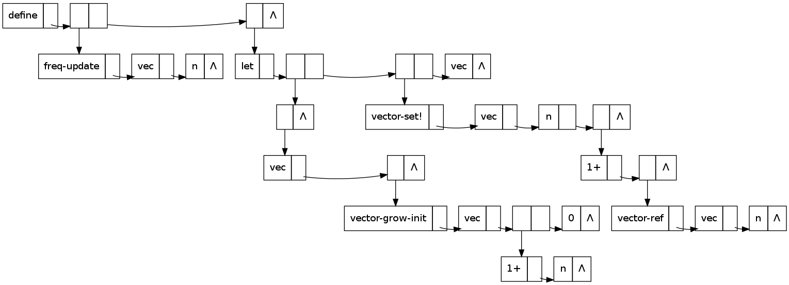
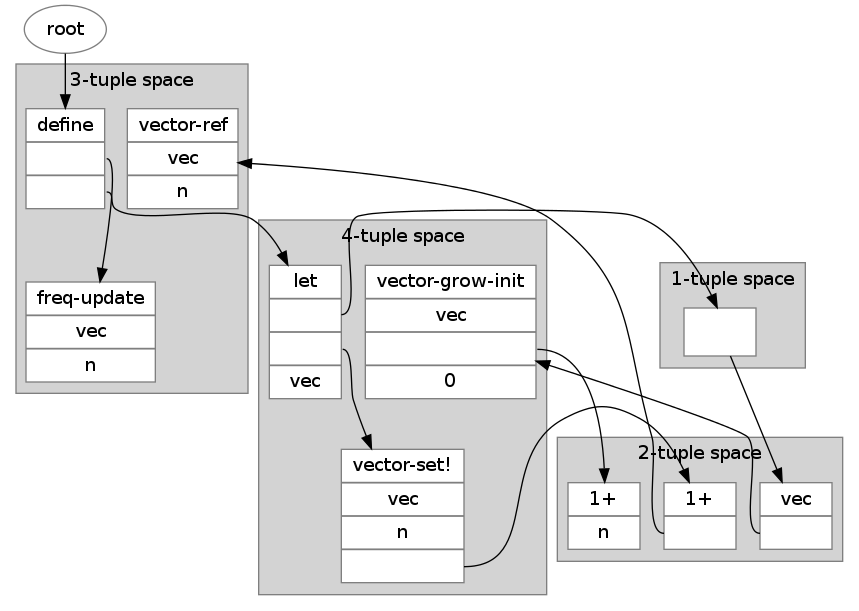

I skimmed [Bobrow’s 01966 “The Structure of a Lisp System using
Two-Level Storage”][0] the other day, and I was struck by his claim
that BBN LISP was fast enough to be usable, even on an 18-bit
[PDP-1][9] (one of 53 ever made!  And possibly the first!)  with a
17–33 *milli*second drum memory (5–10 μs per word sequential read) and
a 16-kibiword core memory (5 μs per random word access, four times the
standard size), even for 2–3 concurrent users.  This is about half the
speed of a Commodore 64 and only 36 KiB of RAM, but the drum was 88
kibiwords and much faster than a Commodore floppy.  I thought I’d go
back and read it in greater depth to see how this was possible.

[0]: https://apps.dtic.mil/dtic/tr/fulltext/u2/647601.pdf
[9]: https://en.wikipedia.org/wiki/PDP-1

Having read it,
I think a number of modern techniques, particularly compressed oops,
index registers, lexical scoping, bytecode, JIT compilation, and generational garbage
collection, should make it possible to build a system with
considerably more bang per computron than Bobrow had to settle for.
Also, modern low-power microcontrollers have amounts of RAM comparable
to the PDP-1’s, but are on the order of 1000 times faster, and have on
the order of 1000 times more secondary storage available, which is
about 100 times faster than the PDP-1’s; this should allow real,
comfortable self-hosting microcontroller development.  All of this can
run on about ten milliwatts.

Review of Bobrow’s paper
------------------------

He allocated 4 KiW of core to compiled code (mostly in a 3400-word
“ring buffer”), 4 KiW to the system (“supervisor and permanent code”,
divided into six overlays), and the other 8 KiW to the stack and heap,
and used two-word CONS cells.  When paging a 256-word page of compiled
Lisp in from the drum, the system linked (“relocated”) it.

It seems like the system could manage at most some 6000 calls per
second:

> Closed subroutine references to an in-core word through the [virtual
> memory page] map takes approximately 170 microseconds (because of
> the poor set of operation codes on the machine, and the lack of an
> index register).

This seems to have been the paper that first published shallow binding
(though in a strange way that uses pointers into the call stack),
tagged pointers for small integers (“offset by 300,000 octal”, both
positive and negative), CDR-coding, and a form of BIBOP typing.  Of
these I thought CDR-coding was the most interesting.

The primary objective of the BIBOP typing was to avoid having to reach
out to the drum for type tests, especially for symbols (where both of
the usual predicates can be answered without waiting for a drum
reference, namely ATOM and EQ) and so a contiguous chunk of the 17-bit
(!)  virtual address space was assigned to almost every type: value
cells† starting at 0o150_000, property list cells†, full words (large
integers), pushdown list (the call stack) starting at 0o200_000,
function cells†, print-name pointers†, print-names, and “hash table”,
which last runs from 0o270_000 (0x17000) to 0o300_000, although all of
this this seems to conflict with the earlier statement that small ints
from -32767 to +32767 were offset by 0o300_000, which would have them
occupy the “address space” from 0o200_000 to 0o400_000.  The virtual
addresses from 0o10_000 to 0o150_000 are shared between “list
structure” (shown growing down) and “compiled code” (shown growing
up); although I have no idea how you would then distinguish a code
pointer from a CONS, perhaps code pointers as such weren’t first-class
values.

(A secondary benefit not mentioned is that CONS cells occupied two
words instead of three, because they don’t need a type tag.)

He says this static allocation is preferred to “provid[ing] an in-core
map of storage areas” because it reduces resident memory pressure (at
the expense of virtual memory space efficiency).  I suppose the 12 KiW
of physical core being used for paging amounts to 48 pages, which is
indeed pretty tight.  If you divided the 17-bit address space up to
0o400_000 into “storage areas” of 0o4_000 homogeneous words, your type
map would have 64 entries.  If you could get by with a 3-bit type code
for each “storage area”, you could squeeze 6 of them into each memory
word; 4 per word would require 16 words of memory for the BIBOP map.
They must have been pretty desperate to save 16 words of memory.  But
then, a static type allocation avoids writing code for dynamic
allocation, too.

Above there are four items marked with “†”; these are the four virtual
memory areas associated with symbols (“each literal atom”).  Each is
0o10_000 in size, so I guess the system supported a maximum of 4096
symbols, and these were in essence parallel arrays.  “A pointer to an
atom\* points to its value cell.”  They’re separated in virtual memory
because accesses to them tend to be not merely uncorrelated but
actually negatively correlated — symbols used for functions tend not
to be used for variables (“value cells”), almost nothing uses property
lists, and print-name pointers are not normally used during actual
computation.  4096 words is 16 256-word pages, so I guess you’d page
in a sixteenth of the symbols’ value cells or function cells or
whatever at a time.

\* They did also consider numbers to be “atoms”.

Aha, here’s the resolution to the dilemma above about overlapping
memory areas: although the call stack starts at 0o200_000, followed by
function cells, print-name pointers, print names, and the hash table,
none of these are first-class values!  If you want to refer to a
symbol, you point to its value cell, not its function cell or print
name, so it’s totally kosher to use the addresses at 0o200_000 and up
for small ints.  Moreover the sequence simplifies some other type
tests: anything over 0o150_000 was an “atom” (symbol or number), but
anything over 0o170_000 was an integer, and anything over 0o200_000
was a *small* integer.  So the boundaries were chosen with an eye to
subset relations.

The “CDR-coding” didn’t actually use less space; the CDR pointers were
still fully materialized!  It just attempted to maximize locality by
allocating `(cons x y)` on the first possible of `y`’s page, `x`’s
page, some page in core, or some swapped-out page.  This used a
per-page free list and an in-core map of per-page free lists, which I
suppose must have used 192 words (!!) for the 49152 words of virtual
memory available for “list structure”.

However, their “additional scheme for dumping onto secondary storage
(magnetic tape)” does maybe seem to have done the full CDR-coding
thing.  This is referenced to “Storage Management in LISP”, Bobrow, in
preparation, Proc. IFIP Conf. on Symbol Manipulation Languages, and [“A
LISP Garbage Collector Algorithm Using Serial Secondary Storage”,
Minsky, AIM-58, 01963][1].

[1]: https://dspace.mit.edu/bitstream/handle/1721.1/6080/AIM-058.pdf

Minsky’s paper seems to be scanned in full but with the page order
askew; it contains the longest program I’ve ever seen written in the
M-expression dialect of LISP, which is not very long at all: 27 lines
of code.  It focuses on writing a sequence of (x, y, z) triples out
onto the drum, which, when read back in, put the dotted pair `(y . z)`
into register (memory location) `x`.  So a linked list of 20 addresses
stored in the cars of 20 consecutive dotted pairs will need *60* words
on the drum, even more than in BBN LISP.  Minsky comments:

> *Collect* has the additional feature that all *cdr* sequences end up
> linearly packed!  There are probably some important applications of
> this.

But I think compaction was his main focus, and I don't think of that
as a hard problem, so I haven’t taken the time to grok *collect* in
fullness.

Prospects for microcontroller systems
-------------------------------------

An STM32F103C8 as used in a Blue Pill runs about 72 MIPS, 64 or
usually 128 KiB of Flash, and 20 KiB of SRAM; the preassembled board
costs about US$2.  This chip uses about 1.5 nJ per 32-bit instruction
and can run ARM code from SRAM.  But 20 KiB isn’t a lot of space, so
you need some external memory.

As mentioned in file `energy-autonomous-computing.md`, and file
`ghz-dds.md`, you can get a variety of memory chips to interface to
the STM32; a rough outline of chips I think may be representative
follows:

<table>
<tr><th>           <th>         <th>    <th colspan=2>read    <th colspan=2>write
<tr><th>           <th>type     <th>Cost<th>ns/byte<th>nJ/byte<th>ns/byte<th>nJ/byte<th>bytes<th>nUS$/byte<th>GPIOs needed
<tr><th>GD25D10C   <td>2SPI NOR <td>30¢ <td>50     <td>0.4    <td>27000  <td>1800   <td>512Ki<td>4600     <td>4? (SPI)
<tr><th>CY62136EV30<td>SRAM     <td>111¢<td>45     <td>6      <td>45     <td>6      <td>256Ki<td>4200     <td>25? (parallel)
<tr><th>23LC1024   <td>QSPI SRAM<td>210¢<td>100    <td>1      <td>100    <td>1      <td>128Ki<td>16000    <td>4? (SPI; 6 if QSPI)
<tr><th>S34MS01G2  <td>SLC NAND <td>100¢<td>45     <td>1.2    <td>160    <td>4.4    <td>128Mi<td>7.5      <td>15? (parallel NAND)
<tr><th>GD5F1GQ4   <td>QSPI NAND<td>250¢<td>56     <td>4      <td>220    <td>16     <td>128Mi<td>19       <td>4? (SPI; 6 if QSPI)
</table>

The parallel SRAM could actually be used in 16-bit-wide mode and get
double the bandwidth and half the power usage, but use 7–8 more GPIO
pins.

In theory it should be possible to gang up a bunch of SPI RAMs or SPI
flash memories (of the same type!) and read from them in parallel,
whether or not you can write to them in parallel.  This would allow
you to address them with a one-pin address bus.

NAND Flash must be read and written a page at a time — the two NAND
chips profiled above use a 2048-byte page size.  It’s very appealing
as a form of secondary storage, especially for frequently-written
data: the energy cost per byte written is lower than anything but a
(volatile!) SPI SRAM, and the dollar cost per byte of capacity is
about three orders of magnitude lower than the alternatives.  The
access latency doesn’t show up in the table, but it's on the order of
50–100 μs, which is nearly 1000 times slower than the 50–200 *n*s of
the other memory types, coincidentally almost precisely in inverse
proportion to the price per byte.

NAND also comes conveniently packaged with a ready-made FTL and SPI
interface in the form of SD cards and MicroSD cards, but I imagine
there might be power costs as well as the well-known reliability
problems introduced by shitty FTLs.

Writing frequently-read data to a NOR Flash might actually save power
as well, but this is an extreme measure: you'd have to read a given
byte from NOR instead of the 23LC1024 SRAM 3000 times before paying
for the cost of writing it into the NOR.

So, suppose we have a system consisting of an STM32F103C8
microcontroller, a 23LC1024 QSPI SRAM, and a GD5F1GQ4 QSPI NAND chip.
When idle it’s using 0.54 μA at 2.5 V in the MCU, 4 μA at 2.5 V in the
23LC1024, and 90 μA at 1.8 V in the NAND unless we turn it off with a
transistor — 162 μW for the Flash and another 11 μW for the rest of
the system.  A 2048-byte major page fault would initially take 114 μs
at 72 mW in the Flash, working out to 8200 nJ, and about 34 μs at, I
don't know, 20 mA and 2.5 V in the MCU, so 50 mW and another 1700 nJ,
total about 9900 nJ.  At that point it’s occupying one of the 10 page
slots in the MCU’s internal SRAM.  Evicting that page to the SRAM (you
might want to evict a subpage instead) would take another 200 μs and
10 000 nJ in the CPU, plus 2000 nJ in the SRAM, which brings up the
very interesting point that low-power SPI SRAM stops being so
low-power if it keeps the CPU busy longer!

A tiny QSPI controller like the Raspberry Pi Pico’s “pioasm”
coprocessors that allowed the CPU to page while continuing to compute
would be super helpful.  The STM32F103C8 does have a 7-channel DMA
controller which can run its two hardware SPI peripherals, so that
might actually be doable.  The SPI peripherals support dual SPI but
not quad SPI, so instead of 100 ns and 56 ns per byte, it would be
200 ns and 112 ns per byte, perhaps with correspondingly increased
power usage in the peripherals — but you could power down the CPU or
have it work on something else.  This might increase the cost of major
page faults to 16 μJ, with a latency of 150 μs, and decrease the cost
of minor ones to 4 μJ, with a latency of 400 μs.

Paging out a dirty page to NAND would also take about 400 μs.

At this rate you could do 2500 minor page faults (plus evictions and
pageouts) or 6700 major page faults per second, but the first would
cost 10 mW and the second would cost 110 mW.  2500 page faults is
about 20 times what you can do on spinning rust.

(Uh, but actually the SPIs on this MCU are only good up to
18 Mbit/s... maybe parallel memory isn’t such a bad option?  Or a
beefier chip?)

Bigger microcontrollers
-----------------------

The STM32F103C8 mentioned above [costs US$5 in the usual venues][2]
when it’s not out of stock, though evidently the Blue Pill makers have
found cheaper chips.  But 20 KiB of internal SRAM is small enough to
be restrictive.  What about bigger STM32F chips, or maybe an ESP32?
The STM32F line goes up to 512KiB SRAM.  Beefier chips might also help
to speed up off-chip communication and thus get it over with faster,
perhaps saving energy.

[2]: https://www.digikey.com/en/products/detail/stmicroelectronics/STM32F103C8T6TR/2122442

<table>
<tr><th>Chip           <th>SRAM size <th>Price    <th>Power draw at 72MHz
<tr><th>STM32F103C8T6  <td>20 KiB    <td>US$5     <td>20 mA?
<tr><th><a href="https://www.digikey.com/en/products/detail/stmicroelectronics/STM32F410C8U6/6166913">STM32F410C8U6</a>
                       <td>32 KiB    <td>US$3.50  <td>8 mA?
<tr><th><a href="https://www.digikey.com/en/products/detail/stmicroelectronics/STM32F401RCT6TR/5268281">STM32F401RCT6TR</a>
                       <td>64 KiB    <td>US$5.50  <td>9 mA?
<tr><th><a href="https://www.digikey.com/en/products/detail/stmicroelectronics/STM32F730V8T6/9453365">STM32F730V8T6</a>
                       <td>256 KiB   <td>US$6     <td>28 mA?
<tr><th><a href="https://www.digikey.com/en/products/detail/stmicroelectronics/STM32F765IGT6/6137836">STM32F765IGT6</a>
                       <td>512 KiB   <td>US$15    <td>28 mA?
<tr><th><a href="https://www.digikey.com/en/products/detail/microchip-technology/ATSAMG53N19B-AU/5057262">ATSAMG53N19B-AU</a>
                       <td>96 KiB    <td>US$1.50  <td>7.2 mA (but only goes up to 48MHz)
<tr><th><a href="https://www.digikey.com/en/products/detail/cypress-semiconductor-corp/CY9AF156NPMC-G-JNE2/7362398">CY9AF156NPMC-G-JNE2</a>
                       <td>64 KiB    <td>US$2     <td>⸘no datasheet‽
<tr><th><a href="https://www.digikey.com/en/products/detail/nuvoton-technology-corporation-of-america/M481ZE8AE/12337367">M481ZE8AE</a>
                       <td>64 KiB    <td>US$2.50  <td>⸘no datasheet‽
</table>

Some of these, like the STM32F730 and STM32F765, have built-in memory
controllers designed to interface to external SRAM, SDRAM (!!), NOR
Flash, and even NAND Flash.

Compact in-memory representations
---------------------------------

The NAND Flash discussed above is huge compared to everything else;
the only penalty for bloated data representations in it is power usage
and memory bandwidth usage.  But for storing data in the
microcontroller’s RAM, it’s crucial to represent it efficiently.  Lisp
data is pretty convenient to compute on but takes up a lotta fricking
bytes.

### Backwards CDR-coding stacks occurred to me, but that’s probably dumb ###

What I originally thought when I skimmed Bobrow’s paper was that he was
going to CDR-code lists in something like the following fashion.  When
some datum z produced by (cons x y) is placed on a page different from
its cdr, it gets allocated a shortish buffer, with a counter and
length packed into a word at its beginning:

    |-----+---+---+---+---+---+---|
    | 2/7 | y | x | - | - | - | - |
    |-----+---+---+---+---+---+---|

If later we execute (let ((w (cons a z))) ...) the first thing we
check is to see whether there’s more space available in z’s buffer.
There is, so we stuff a into it:

    |-----+---+---+---+---+---+---|
    | 3/7 | y | x | a | - | - | - |
    |-----+---+---+---+---+---+---|

Now, if we later cons something else onto w, like b, we may well be
able to pack that into the same buffer:

    |-----+---+---+---+---+---+---|
    | 4/7 | y | x | a | b | - | - |
    |-----+---+---+---+---+---+---|

Eventually the buffer gets full, or we try to cons two things onto the
same thing, so then we allocate a new buffer, ideally on the same
page.  If the buffer got full we might want to allocate a bigger
buffer.

This is all assuming there’s some sensible way to represent and
dereference pointers into these buffers, and of course it would make
RPLACD (set-cdr!) quite tricky.

With a buffer size of 8 words, like the above, we can store 6 cons
cells in it, which would normally take 12 words, which is a best-case
savings of 33%; as the buffer size grows, this approaches 50%.  The
worst-case inflation for 8 words is 4× (300%) but most lists are
longer than that.  The break-even point is at 4-item lists.

A quick Scheme program to count the lengths of lists, applied to
itself, found 2 lists of length 0, 3 lists of length 1, 33 lists of
length 2, 22 lists of length 3, 12 lists of length 4, and one list of
length 5, which was the whole program and therefore possibly should
not be counted.  This is clearly not a fully representative sample of
the data structures Lisp programs manipulate but it’s probably true
that lists of length 2 and 3 are much more common than other lengths.
(Also, none of the lists were improper.)

So, possibly a more optimal solution would be to use an initial buffer
of size 4, and use a header bit to indicate whether the list is
NIL-terminated or improper (or continued elsewhere).  Then a 2-item
list would be 4 words, the break-even point:

    |---------+---+-------------+---+
    | NIL/2/3 | 1 | delete-char | - |
    |---------+---+-------------+---+

And a 3-item list would also be 4 words, a 33% saving over the
standard approach:

    |---------+-----+-----+--------------|
    | NIL/3/3 | end | beg | make-overlay |
    |---------+-----+-----+--------------|

If we initially allow such buffers (“obstacks”?  “arenas”?) to extend
to the end of their page, only capping them off at a bit over their
current capacity when we want to allocate something else, we can
reduce the number of spills.  For example, consider parsing this
Scheme into lists through recursive descent:

    (define (freq-update vec n)
      (let ((vec (vector-grow-init vec (1+ n) 0)))
        (vector-set! vec n (1+ (vector-ref vec n)))
        vec))

Here’s the conventional dotted-pair representation:

In Graphviz:

    digraph fu {
            node [shape=record, label="<car>|<cdr>"]
            {
                    rank=same;
                    1 [label="define|<cdr>"];
                    1:cdr -> 2;
                    2:cdr -> 6;
                    6 [label="<car>|Λ"];
            }
            2:car -> 3;
            {
                    rank=same;
                    3 [label="freq-update|<cdr>"];
                    4 [label="vec|<cdr>"];
                    5 [label="n|Λ"];
                    3:cdr -> 4;
                    4:cdr -> 5;
            }
            6:car -> 7;
            {
                    rank=same;
                    7 [label="let|<cdr>"];
                    7:cdr -> 8;
                    8:cdr -> 10;
                    10:cdr -> 12;
                    12 [label="vec|Λ"];
            }
            8:car -> 9;
            9 [label="<car>|Λ"];
            9:car -> 13;
            {
                    rank=same;
                    13 [label="vec|<cdr>"];
                    13:cdr -> 14;
                    14 [label="<car>|Λ"];
            }

            14:car -> 15;
            {
                    rank=same;
                    15 [label="vector-grow-init|<cdr>"];
                    15:cdr -> 16;
                    16 [label="vec|<cdr>"];
                    16:cdr -> 17;
                    17:cdr -> 18;
                    18 [label="0|Λ"];
            }

            17:car -> 19;
            {
                    rank=same;
                    19 [label="1+|<cdr>"];
                    19:cdr -> 20;
                    20 [label="n|Λ"];
            }

            10:car -> 21;
            {
                    rank=same;
                    21 [label="vector-set!|<cdr>"];
                    21:cdr -> 22;
                    22 [label="vec|<cdr>"];
                    22:cdr -> 23;
                    23 [label="n|<cdr>"];
                    23:cdr -> 24;
                    24 [label="<car>|Λ"];
            }

            24:car -> 25;
            {
                    rank=same;
                    25 [label="1+|<cdr>"];
                    25:cdr -> 26;
                    26 [label="<car>|Λ"];
            }

            26:car -> 27;
            {
                    rank=same;
                    27 [label="vector-ref|<cdr>"];
                    27:cdr -> 28;
                    28 [label="vec|<cdr>"];
                    28:cdr -> 11;
                    11 [label="n|Λ"];
            }
    }

With recursive descent, the first cons we do is of `vec` onto `'()`,
creating a new buffer:

    |-----------+-----+-----
    | NIL/1/256 | vec | ... 
    |-----------+-----+-----

Then we start a totally new list by consing `n` onto `'()`, so we cap
off this one with a little room to grow and start a new one:

    |---------+-----+---+-----------+---+-----
    | NIL/1/2 | vec | - | NIL/1/252 | n | ... 
    |---------+-----+---+-----------+---+-----

Then we cons `vec` and `vector-ref` onto that:

    |---------+-----+---+-----------+---+-----+------------+-----
    | NIL/1/2 | vec | - | NIL/3/252 | n | vec | vector-ref | ... 
    |---------+-----+---+-----------+---+-----+------------+-----

Then we cap off that entire list and cons it onto `'()` followed by
`1+`:

    |---------+-----+---+---------+---+-----+------------+---+---+-----------+----+----+-----
    | NIL/1/2 | vec | - | NIL/3/5 | n | vec | vector-ref | - | - | NIL/2/246 | #6 | 1+ | ... 
    |---------+-----+---+---------+---+-----+------------+---+---+-----------+----+----+-----

So far we have 6 conses in 12 words, which is a singularly uninspiring
performance.

### A depth list ###

A maybe more interesting representation of the above S-expression
might annotate a flat list of atoms with their depths:

    (define (freq-update vec n) (let ((vec (vector-grow-init vec ...
        1         2       2  2    2     4           5         5

but of course this is not only just as many words of memory, it does
not contain enough information to reconstruct the S-expression!

### An RPN operation stream ###

An RPN approach to reconstructing it might intersperse a series of
N-ary operators on the symbol list:

    1+ vector-ref vec n 3! 2! vec 4!

which at least compresses the six conses above down to 7 words instead
of 12.  For functions of fixed arity the N-ary operators are, strictly
speaking, unnecessary — forward Polish notation is sufficient,
so you could imagine representing that
S-expression with the following whitespace-separated tokens:

    define( freq-update vec n ){
        let( vec vector-grow-init vec 1+ n 0 ){
            vector-set! vec n 1+ vector-ref vec n
            vec
        }
    }

That successfully represents the function code in 23 words, rather
than 28 conses and thus 56 words, but at the cost of pushing most of
the arity information into the symbols instead of the conses, which
makes it quite awkward to compute with.

### Algebraic data types, or variant records ###

In the particular case that what you want to represent is something
analogous to Scheme source code, a structier approach may work better,
using ML-like pattern-matching and constructors, but Golang-like
slices for things like argument lists.  That is, while you’re building
up an argument list, by all means use a cons list, but once you’re
done building it, freeze it into a counted array, which you can
comfortably cdr down with a slice.  So, for example, `let` here takes
some variable-initializer pairs and some body expressions, in this
case one of the first and two of the second; and a function call takes
a function expression and some number of argument expressions.

Here’s a thing that might look like in Graphviz:

    digraph x {
            node [shape=record]
            func [label="<head>def|{name|freq-update}|<args>args|<body>body"]
            func:args -> funcargs:head;
            funcargs [label="<head>2|vec|n"]
            func:body -> let:head;

            let [label="<head>let|<vars>vars|<body>body"];
            let:vars -> vars:head;
            vars [label="<head>1|{vec|<init1>}"];
            vars:init1 -> vecinit:head;
            vecinit [label="<head>call|{rator|vector-grow-init}|<rands>rands"];
            vecinit:rands -> vrands:head;
            vrands [label="<head>3|vec|<incn>|0"]
            vrands:incn -> incn:head;
            incn [label="<head>call|{rator|1+}|<rands>rands"];
            incn:rands -> incnrands:head;
            incnrands [label="<head>1|n"];

            let:body -> body:head;
            body [label="<head>2|<1>|vec"];
            body:1 -> x:head;
            x [label="<head>call|{rator|vector-set!}|<rands>rands"];
            x:rands -> y:head;
            y [label="<head>3|vec|n|<z>"];
            y:z -> z:head;
            z [label="<head>call|{rator|1+}|<rands>rands"];
            z:rands -> zz:head;
            zz [label="<head>call|{rator|vector-ref}|<rands>rands"];
            zz:rands-> zrands:head;
            zrands [label="<head>2|vec|n"];
    }

It looks better rendered with Graphviz dot, but Graph::Easy manages a
crude ASCII-art rendition which I’ve cleaned up here:

                       +-----------------------------------------------------------------------+
                       |                                                                       |
                       |   +------+--------+--------------+-------+------+     +-----+------+-------+                                                             +------+-----+----+
                       |   | def  |  name  | freq-update  |  args | body | --> | let | vars |  body |                                                             |  2   | vec |  n |
                       |   +------+--------+--------------+-------+------+     +-----+------+-------+                                                             +------+-----+----+
                       |                                     |                          |                                                                           ^
                       |                                     |                          |                                                                           |
                       v                                     v                          v                                                                           |
                     +----+-------+--------+               +------+------+----+       +-----+-------+--------+         +------------------+--------+-------------+-------+
                     | 2  |       |   vec  |               |  2   |  vec |  n |       |  1  |  vec  |        |         |       call       | rator  | vector-ref  | rands |
                     +----+-------+--------+               +------+------+----+       +-----+-------+--------+         +------------------+--------+-------------+-------+
                             |                                                                         |                 ^
                             |                                                                         |                 +--------------------------------------------------------+
                             v                                                                         v                                                                          |
                           +------+--------+--------------+-------+                                  +-------+--------+-------------------+--------+                              |
                           | call | rator  | vector-set!  | rands |                                  | call  | rator  | vector-grow-init  |  rands |                              |
                           +------+--------+--------------+-------+                                  +-------+--------+-------------------+--------+                              |
                                                             |                                                                               |                                    |
                                                             |                                                                               |                                    |
                                                             v                                                                               v                                    |
    +------+--------+-----+-------+                        +------+------+----+------+       +------+--------+--------+-------------------+--------+-------------+-------+-----+  |
    | call | rator  | 1+  | rands |                        |  3   |  vec |  n |      | ----> | call | rator  |   1+   |       rands       |    3   |     vec     |       |  0  |  |
    +------+--------+-----+-------+                        +------+------+----+------+       +------+--------+--------+-------------------+--------+-------------+-------+-----+  |
      ^                      |                                                                                           |                                          |             |
      |                      |                                                                                           |                                          |             |
      |                      v                                                                                           |                                          |             |
      |                    +------+--------+                                                                             |                                          |             |
      |                    |  1   |    n   |                                                                             +------------------------------------------+-------------+
      |                    +------+--------+                                                                                                                        |
      |                                                                                                                                                             |
      +-------------------------------------------------------------------------------------------------------------------------------------------------------------+

Here “rator”, “rands”, “vars”, and “body” are just field labels; they
don’t occupy space on their own behalf, but they’re associated with
pointers which do.  The type-tags “def”, “let”, and “call” might
possibly be able to be erased to some degree at runtime, or possibly
handled in a BIBOP fashion.  The “vars” of “let” are special in that
the list is a list of 2-tuples, one of them in this case.  If the
type-tags are not erased, by my count this is 44 words of memory,
which is better than 56 but still not great.

If we can erase the type-tags (but not the vector lengths), that drops
us by 7 to 37 words.  Also, in most cases, the vectors could be tacked
onto the end of their parent record, eliminating a pointer, although
this might conflict with type-tag erasure (since they’d be allocated
within the same page as their parent record) as well as mutability
(since this would necessitate copying them if another such record
wanted to “reference” them, which would also be a possible solution to
the erasure problem); the exceptions are func:args and let:vars.  This
reduces the space cost to 31 words.

(I notice one error in this diagram: the vector-ref call is being
referenced directly from a rands field rather than by way of a
1-element vector.  This makes 44 46, 37 39, and 31 32.)

32 memory words is 43% less space than 56.  The ASCII Scheme version,
which is inconvenient for computation, is 133 bytes, while 32 32-bit
words is slightly smaller at 128 bytes — not counting the print-names
of the symbols, which are shared with all of their other occurrences.

I think this sort of thing, inspired by ML ADTs, is likely to actually
be *more* convenient for programming than S-expressions, as well as
more space-efficient.

#### BIBOP tagging for variant record tags ####

A possible BIBOP-alternative approach to handling type-tags, which
still doesn’t require wasting an entire word in every object, is to
store them on a separate page.  Suppose we do embed the “rands” into
call records, so their size depends on the number of arguments: two
words if no arguments, three words if one argument, four words if two
arguments, and so on; and suppose we use an allocator that allocates a
page or subpage for each allocation size to prevent fragmentation
(which of course conflicts with the locality-of-reference
objective...).  A 2048-byte page of 4-byte words has 512 words on it;
if it’s divided into four-word objects, there will be 128 of them.
Perhaps the memory allocator maintains a 128-bit bitmap of them
elsewhere.  Perhaps on a type-tag page there are 128 bytes that tell
us the types of those 128 four-word objects: some may be two-argument
calls, while others are single-expression-body lets, and others are
single-expression-body defs.  (This presumes that there are no more
than 256 total type tags for four-word objects, and may lead to “read
amplification” where we fault in an entire type-tag page even though
15 of the 16 pages it maps are swapped out.)

Probably a more reasonable approach is to dedicate pages to particular
types of objects, such as calls, and subdivide them by size.  So a
2048-byte page of calls might have 512 bytes (128 words, 64 objects)
of two-word zero-argument calls; 512 bytes (42 objects) of three-word
one-argument calls; 512 bytes (32 objects) of two-argument calls; and
512 bytes (25 objects) of three-argument calls.  This allows you to
minimize fragmentation and still do type-tests without faulting any
pages in or limiting your number of types.

### An immutable vector, or packed tuple, per list ###

A different memory representation, much closer to the Lisp approach,
would be to just replace lists with vectors.  You can see that the
Scheme code contains 10 lists and 19 atom references, for a total of
28 conses; here’s the code again:

    (define (freq-update vec n)
      (let ((vec (vector-grow-init vec (1+ n) 0)))
        (vector-set! vec n (1+ (vector-ref vec n)))
        vec))

(Or you can calculate it with this dumb code:

    (define (atom-count sexp)
      (cond ((null? sexp) 0)
            ((pair? sexp) (+ (atom-count (car sexp))
                             (atom-count (cdr sexp))))
            (#t 1)))

    (define (cons-count sexp)
      (cond ((null? sexp) 0)
            ((pair? sexp) (+ 1 
                             (cons-count (car sexp))
                             (cons-count (cdr sexp))))
            (#t 0)))

    (define (nil-count sexp)
      (cond ((null? sexp) 1)
            ((pair? sexp) (+ (nil-count (car sexp))
                             (nil-count (cdr sexp))))
            (#t 0)))

)

If you were to replace each list with a counted vector, these 28
conses in 10 lists would be only 38 words:

    |---+-------------+-----+---+   +---+----+---|
    | 3 | freq-update | vec | n |   | 2 | 1+ | n |
    |---+-------------+-----+---+   +---+----+---|
    
And if you were to segregate these vectors or tuples into pages or
subpages by size, you could then omit the count fields (except on
vectors too long to belong to a whole category of same-sized vectors,
which would still need counts).  Then instead of 38 words they would
be 28 words.  Optimal!  All we had to sacrifice was mutability and
tail sharing.

A Graphviz visualization looks like this:

    digraph fu {
            node [shape=record, style=filled, fillcolor=white, color="#7f7f7f"]
            graph [style=filled, fillcolor=lightgrey, color="#7f7f7f"]
            root [shape=oval];
            root -> 6;

            subgraph cluster_1 {
                    label="1-tuple space";
                    5 [label="<0>"];
            }

            subgraph cluster_2 {
                    label="2-tuple space";
                    2 [label="{1+|n}"];
                    4 [label="{vec|<1>}"];
                    9 [label="{1+|<1>}"];
            }

            subgraph cluster_3 {
                    label="3-tuple space";
                    1 [label="{freq-update|vec|n}"];
                    6 [label="{define|<1>|<2>}"];
                    10 [label="{vector-ref|vec|n}"];
            }

            subgraph cluster_4 {
                    label="4-tuple space";
                    3 [label="{vector-grow-init|vec|<2>|0}"];
                    7 [label="{let|<1>|<2>|vec}"];
                    8 [label="{vector-set!|vec|n|<3>}"];
            }

            3:2 -> 2;
            4:1 -> 3;
            5:0 -> 4;
            6:1 -> 1;
            6:2 -> 7;
            7:1 -> 5;
            7:2 -> 8;
            8:3 -> 9;
            9:1 -> 10;
    }

An astonishing thing is that these 28 words are *smaller* than the 32
words taken up by the ML-like data structure outlined above, and under
much less dubious assumptions.

This is clearly a broadly applicable data representation for things
like syntax trees, binary search trees, and hash tables; and because
you can do random access within the counted array it’s a reasonable
structure for things like binary search and (non-in-place, because
immutable) quicksort as well.

#### Several approaches to efficiently CDRing down such vectors ####

First, we could use ordinary pointers into the vectors as the iterator
states.  Unsafe cdr would then just be a pointer increment, but the
null test would then require decoding the pointer’s bit representation
and doing some kind of lookup to figure out what size the vector was,
and maybe doing a modulo by the vector size (3 or 5 or something) to
find the offset into the vector.  This sounds like it would make
cdring down a list spectacularly slow.

Second, we could use some kind of fat-pointer representation of
iterators/ranges, like a base pointer and an offset, or an iterator
pointer and an upper-bound pointer.  CDR and NULL? are then fast but
their argument no longer fits in a register; it needs two registers.
(And, in the case of CDR, the result.)  This has the additional
advantage that you can efficiently refer to any range of a list, not
just suffixes, and algorithms like binary search in the list also become
more natural to express.  With a Lua-like calling convention this isn’t
necessarily a big practical problem for programming but it does add
complexity, and you need list→iter and perhaps iter→list functions of
some kind.  list→iter in particular has to figure out how big the list
is, through the kinds of pointer decoding and lookup that NULL? would
have had to do in the previous option, but fortunately without the
division operation.

Third, we could try to cram the fat-pointer representation into a
single word somehow.  For example, we could 8-byte-align all our
vector pointers and use the three low-order bits to indicate an offset
from 0 to 7, and chain together vectors to make lists of more than 8
items.

Fourth, we could maybe burst the vector into a conventional pile of
dotted pairs when we start iterating over it, in some kind of very
cheap garbage collection nursery or something.  This obviously
sacrifices mutability, which we already sort of did, but also
damages EQ on lists, and it adds to the load on the GC.

Fifth, we could use a stateful generator coroutine, which is in some
sense another version of “fat pointers”.

Incrementing a pointer in a loop, testing it against an end pointer,
to do a linear search for a key, looks like this in reformatted GCC
listing output for amd64, with the loop preamble removed:

      25 0010 4883C708      .L8:    addq    $8, %rdi      # increment pointer
      27 0014 4839FE                cmpq    %rdi, %rsi    # compare against end pointer
      28 0017 7405                  je      .L2           # (fused with previous) exit loop
      31 0019 483907        .L6:    cmpq    %rax, (%rdi)  # compare against search key in %rax
      32 001c 75F2                  jne     .L8           # loop while not found
      33                    .L2:

So it’s about 3–5 RISC instructions or micro-ops — and *zero* data
memory accesses! — per loop iteration.

A context switch to a stateful generator coroutine can be as simple as
an indirect jump or call, followed by another indirect jump or return
later; but more generally you should expect to pay nearly the usual
procedure entry/exit cost, because a lower cost would imply
partitioning the register file between the generator and the consumer.
Whatever registers the consumer clobbers aren’t available to maintain
generator state, and whatever registers the generator clobbers aren’t
available to maintain consumer state.  The generator can keep its
stack frame around from one yield to the next, but it still has to
save any relevant callee-saved registers upon resuming and restore
them on yielding, and vice versa for caller-saved registers.

#### *Not* CDRing down packed vectors ####

Many lists — though few in the above example — are used as fixed-arity
tuples rather than variable-length lists, and for these lists we’re
probably most interested in pattern-matching them against patterns of
the same arity, rather than iterating over their members.  This is
clearly much more efficient to do with these packed tuples than with
linked lists of dotted pairs.

#### Building such packed-tuple vectors ####

If you knew how many things are going to be in your output list, you
could maybe preallocate it.  MAPCAR, for example, could do this.

But the usual kind of Lisp code doesn’t know in advance how big a list
it’s building, and knowing would make it more complicated.  Consider
this example (part of my solution to an exercise from Essentials of
Programming Languages):

    (define (set-subtract includes excludes)
      (cond ((null? includes) '())
            ((member (car includes) excludes) (set-subtract (cdr includes) excludes))
            (#t (cons (car includes) (set-subtract (cdr includes) excludes)))))

You could quibble with the crude coding style and the O(MN) algorithm,
but I think it’s fair to say that writing recursive definitions of
that sort and having them run with reasonable efficiency is a big part
of the appeal of Lisp.  But how do you write such a recurrence in this
natural way, without losing the space-efficiency benefits of the
packed vector representation?

One thing you could of course do is have a function that converts
explicitly from the unpacked chain-of-dotted-pairs form into the
packed form, and invoke it after the final recursive call:

    (define (set-subtract includes excludes)
      (list->packed
            (let recur ((includes includes))
              (cond ((null? includes) '())
                    ((memb (ca includes) excludes) (recur (cd includes)))
                    (#t (cons (ca includes) (recur (cd includes))))))))

Exposing the difference to the user in this way would eliminate the
necessity for the ordinary functions `car` and at least `cdr` and so
on to handle both vector iterators (whatever their form) and
dotted-pair iterators, which might make them run faster.  (However, if
they’re doing a run-time safety check, I think the extra cost to fall
back to a more general dispatch when the expected-type check fails is
probably insignificant.)

Alternatively, you could let the garbage collector take care of it:
when it copies a linked list of immutable dotted pairs out of the
nursery, it can count its length and copy it as a packed tuple into
the appropriate packed tuple bucket, instead of copying the dotted
pairs individually.  This does require `cdr` to check which
representation is in use at any given moment, though.  And sometimes
it’s important for both space and time to preserve some tail sharing
(though you can always restructure algorithms to do their sharing via
the `car`).

Such approaches were inconceivable before the invention of
generational garbage collection in the mid-01980s.

(It might even be worthwhile to include the list length in the dotted
pairs when you create them; although this fills up the nursery faster,
it means the GC doesn’t have to pretraverse the list to count its
length before packing it.)

As a third alternative you might consider explicit *mutability*:

    def set_subtract(includes, excludes):
        result = []
        for item in includes:
            if item not in excludes:
                result.append(item)

        return result

But this doesn’t really help with the problem at hand; CPython has to
preallocate a bunch of extra slack space for `result`, probably
several times, and the last time most of it never gets used.  If you
say `return tuple(result)` you eliminate this space waste at the cost
of an extra copy, similar to the `list->packed` approach.

It sure is a lot less fucking code than the Scheme, though, isn’t it?

In this particular case an additional angle on the problem is to
consider `set-subtract` as a potentially lazy sequence transformer,
usable for example as a generator coroutine:

    def set_subtract(includes, excludes):
        for item in includes:
            if item not in excludes:
                yield item

If you want to materialize it, though, that still doesn’t help; the
consumer of the generated sequence can do whatever they want with it,
including packing it into a vector, but *they* don’t know in advance
how big it is either!

Compressed oops
---------------

So far everything described has use “words”, but I think the “Large
Object-Oriented Memory” approach may be suitable for this kind of
microcontroller system.  [Load and store instructions to internal SRAM
on ARM Cortex-M3 microcontrollers commonly take 2 clock cycles][2],
though sometimes this can be pipelined, so I’m guessing this would be
28 ns on the STM32F103C8 at 72 MHz, or 7 ns per byte.  This is around
8–32 times faster than the access times to any of the other memories
considered above, and consumes almost proportionally less energy, so
avoiding off-chip access as much as possible would seem to be
paramount.

[2]: https://community.arm.com/developer/ip-products/processors/f/cortex-m-forum/5177/instruction-timings---arm-cortex-m3

The LOOM Smalltalk paper used 32-bit ordinary object pointers (“oops”)
on disk, but 16-bit “compressed oops” in RAM.  An in-RAM object table
kept track of the correspondence.  Such an approach could probably
nearly double the effective capacity of the 20-KiB RAM on such a
microcontroller.  20 KiB is enough to hold 20480 bytes, 10240 16-bit
compressed oops, or 5120 32-bit oops or two-element vectors of 16-bit
compressed oops.  Moreover, for the NAND Flash sizes I was talking
about above, you might want 40-bit or 48-bit uncompressed oops!

Even the largest low-power microcontrollers considered above have only
96 KiB of on-chip SRAM: 98304 bytes, 49152 compressed oops, 24576
dotted pairs or two-element vectors made of compressed oops, or 12288
32-bit oops.  So clearly a 16-bit field is enough to address all the
objects that will fit into SRAM at a time.

Compare these to the 4096 symbols and 0o140_000 = 49152 words devoted
to compiled code and list structure in Bobrow’s paper: that’s also
24576 dotted pairs!  But shared only with compiled code, not with
symbols and integers and whatnot.  We can take some comfort in being
able to page things in 6000 times a second instead of 30 times a
second — but in proportion to CPU speed this swapping rate is actually
much slower.  Bobrow’s 17-ms average rotational latency was only about
1000–2000 machine instructions, while 150 μs is about *ten* thousand
instructions for our CPU.  However, we can expect even much faster
performance than that: Bobrow was only getting 6000 subroutine calls
per second, about 15 instructions per call, which he attributes to the
weaknesses of the PDP-1’s instruction set, but we ought to be able to
get something like two or three times that amount.

LOOM supposedly paged objects in and out one at a time, but I can’t
imagine that working very well for things like disk or NAND.  Evicting
individual objects would be fine for things like external SRAM, and
faulting *in* individual objects would be fine for things like NOR.

Bytecode
--------

Zork, old Macintosh versions of Excel, GNU Emacs, and Smalltalk
systems get a lot of mileage out of bytecode virtual machines, which
allow them to squeeze a lot more code into very small computers than
you would think possible.  This command from my .emacs is 16 lines of
code, but it compiles to 44 bytes of Elisp bytecode, plus some tables
of constants and external references (literals, symbols):

    (defun markdown-tt-word ()
      "Hit N times to enclose previous N chunks of nonwhitespace in `` (for Markdown)."
      (interactive)
      (if (looking-back "`")
          (save-excursion
            (backward-char)

            (search-backward "`")
            (delete-char 1)

    ;; (backward-word) previously
            (search-backward-regexp "\\S-")
            (search-backward-regexp "\\s-")
            (forward-char)

            (insert "`"))
        (progn
          (insert "`")
          (save-excursion
            (backward-word) ; should this use the same simpler approach?
            (insert "`")))))

I think it’s atypically dense to get just 3 bytes of bytecode per line
of code; 6 bytes per line is probably closer.

Here’s a disassembly of the 44 bytes.  You can see that they use a
stack bytecode with a single operand — usually packed into the same
byte, much like Smalltalk bytecode, but in the case of `goto-if-nil`
it seems to have a two-byte immediate operand following the bytecode.
The operands packed into constant and varref bytecodes are indexes
into pools of such things, again as in Smalltalk.  Specific opcodes
are allocated to popular Emacs operations like `save-excursion`,
`forward-char`, and `forward-word`.

    byte code for markdown-tt-word:
      args: nil
     interactive: nil
    0       constant  looking-back
    1       constant  "`"
    2       call      1
    3       goto-if-nil 1
    6       save-excursion 
    7       constant  -1
    8       forward-char 
    9       discard   
    10      constant  search-backward
    11      constant  "`"
    12      call      1
    13      discard   
    14      constant  delete-char
    15      constant  1
    16      call      1
    17      discard   
    18      constant  search-backward-regexp
    19      constant  "\\S-"
    20      call      1
    21      discard   
    22      constant  search-backward-regexp
    23      constant  "\\s-"
    24      call      1
    25      discard   
    26      constant  nil
    27      forward-char 
    28      discard   
    29      constant  "`"
    30      insert    
    31      unbind    1
    32      return    
    33:1    constant  "`"
    34      insert    
    35      discard   
    36      save-excursion 
    37      constant  -1
    38      forward-word 
    39      discard   
    40      constant  "`"
    41      insert    
    42      unbind    1
    43      return    

Let’s see how our example code from earlier fares:

    (define (freq-update vec n)
      (let ((vec (vector-grow-init vec (1+ n) 0)))
        (vector-set! vec n (1+ (vector-ref vec n)))
        vec))

In Elisp that’s spelled:

    (defun freq-update (vec n)
      (let ((vec (vector-grow-init vec (1+ n) 0)))
        (aset vec n (1+ (aref vec n)))
        vec))

Emacs compiles the code part of this to 18 bytes of bytecode, 4½ per
line; this is a lot less than 28 compressed oops (56 bytes).

    byte code for freq-update:
      args: (vec n)
    0       constant  vector-grow-init
    1       varref    vec
    2       varref    n
    3       add1      
    4       constant  0
    5       call      3
    6       dup       
    7       varbind   vec
    8       varref    n
    9       varref    vec
    10      varref    n
    11      aref      
    12      add1      
    13      aset      
    14      discard   
    15      varref    vec
    16      unbind    1
    17      return    

It’s a little bit unfair not to count the argument list and constants
vector here, because they allow the references to `vec` and `n` and
`vector-grow-init` to fit into a few bits of a byte, while normally
they would require 8 bytes, as the elements of the argument list and
constants vector do.  Only a little unfair, though.

PICBIT was a bytecoded Scheme for PIC microcontrollers, but its
bytecode was an order of magnitude fatter than the 6 bytes per line of
code I suggested above; it was a successor to the slimmer BIT, which
fit the R4RS Scheme library into under 8000 bytes of bytecode.

It’s probably worthwhile to burn large amounts of bytecode into the
microcontroller’s Flash and interpret it from Flash; that way you
don’t have to spend precious RAM on code.  (128 KiB would hold about
20,000 lines of high-level code by the above estimate — the whole VPRI
STEPS complexity budget — but of course the system has to use some
memory too.)  It’s probably okay for loading a new application to take
a good fraction of a second if that frees up RAM for data.  Most
modern microcontrollers support pagewise reprogramming of their
internal (NOR, painfully slow) Flash during operation, so this kind of
thing should be acceptable even for exploratory interactive
development.
