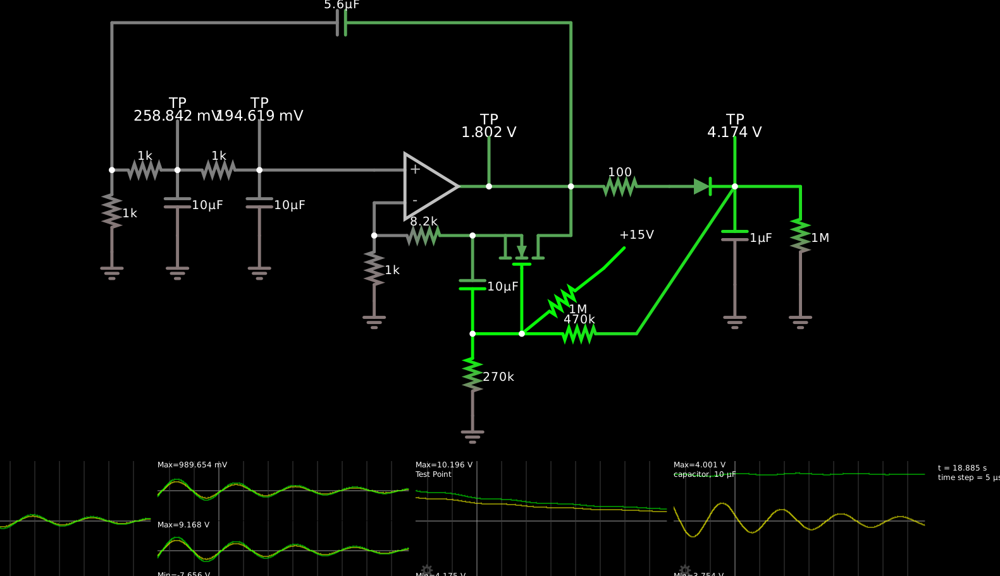

I was playing with Falstad’s simulator and managed to rig up [an analog
oscillator with a single op-amp and a phase-delay network].

    $ 1 0.0000049999999999999996 9.384708165144016 72 5 43 5e-11
    r 144 368 208 368 0 1000
    c 208 368 208 432 0 0.00001 1.2650021009105155 0.001
    g 208 432 208 464 0 0
    368 208 368 208 304 0 0
    r 208 368 288 368 0 1000
    c 288 368 288 432 0 0.00001 1.5479202079950323 0.001
    g 288 432 288 464 0 0
    368 288 368 288 304 0 0
    368 512 384 512 320 0 0
    w 512 384 592 384 0
    w 592 384 592 224 0
    a 400 384 512 384 9 15 -15 1000000 1.3636380375651858 1.5479202079950323 100000
    w 400 400 400 432 0
    w 288 368 400 368 0
    w 592 384 592 432 0
    r 592 432 400 432 0 10000
    r 400 432 400 496 0 1000
    g 400 496 400 512 0 0
    c 144 224 592 224 0 0.0000056 -14.316394194122497 0.001
    r 144 368 144 448 0 1000
    g 144 448 144 464 0 0
    w 144 224 144 368 0
    r 592 384 688 384 0 22000
    d 688 384 752 384 2 default
    c 752 384 752 480 0 4.7000000000000004e-8 14.452075111159305 0.001
    g 752 480 752 512 0 0
    w 752 384 816 384 0
    r 816 384 816 480 0 1000000
    g 816 480 816 512 0 0
    368 752 384 752 320 0 0
    o 3 64 0 4099 2.5 3.2 0 2 3 3
    o 7 64 0 4099 2.5 3.2 1 2 7 3
    o 8 64 0 4099 20 25.6 1 2 8 3
    o 29 64 0 4099 20 25.6 2 2 29 3

[0]: https://tinyurl.com/yf4ralng

The big issue here is that the waveform is not very controllable; it
spontaneously starts oscillating in what is at first a nice
exponentially growing sinusoid, but rapidly hits the opamp rails, at
which point it continues to oscillate nicely but no longer
sinusoidally.  So I was thinking I could maybe rig up a peak detector
and use that to control a MOSFET to control the loop gain.  I was
scared to use a low-impedance peak detector, since the impedances in
the rest of the circuit are kind of high, but now I realize that was
silly since the peak detector is directly connected to the op-amp
output... so even 100Ω and 1μF don’t load the simulated circuit.

So the idea is to decrease the amplifier gain when the peak detector
voltage is too high, and increase it when it’s too low.  An N-MOSFET
in the ohmic region decreases its resistance when its gate voltage
goes high, and increases it when it's low.  So if I add an N-MOSFET
into the negative feedback path for the op-amp, I would want to add it
where the gain goes up when its resistance goes up, which is to say,
between the inverting input and the output.  This has the complicating
factor that the source of the MOSFET won’t be at ground but rather
somewhere near the input, which could result in modulating the gain
with the waveform.

[This almost works][3]:

    $ 1 0.0000049999999999999996 58.69854309417089 72 5 43 5e-11
    r 144 368 208 368 0 1000
    c 208 368 208 432 0 0.00001 0.2588422704884921 0.001
    g 208 432 208 464 0 0
    368 208 368 208 304 0 0
    r 208 368 288 368 0 1000
    c 288 368 288 432 0 0.00001 0.19461855112354048 0.001
    g 288 432 288 464 0 0
    368 288 368 288 304 0 0
    368 512 384 512 320 0 0
    w 512 384 592 384 0
    w 592 384 592 224 0
    a 400 384 512 384 9 15 -15 1000000 0.19460053421583465 0.19461855112354048 100000
    w 400 400 400 432 0
    w 288 368 400 368 0
    w 592 384 592 432 0
    r 496 432 400 432 0 8200
    r 400 432 400 496 0 1000
    g 400 496 400 512 0 0
    c 144 224 592 224 0 0.0000056 -1.4716772955110715 0.001
    r 144 368 144 448 0 1000
    g 144 448 144 464 0 0
    w 144 224 144 368 0
    r 592 384 688 384 0 100
    d 688 384 752 384 2 default
    c 752 384 752 480 0 0.000001 4.174094771849374 0.001
    g 752 480 752 512 0 0
    w 752 384 816 384 0
    r 816 384 816 480 0 1000000
    g 816 480 816 512 0 0
    368 752 384 752 320 0 0
    f 544 464 544 432 32 3 0.02
    w 560 432 592 432 0
    w 496 432 528 432 0
    c 496 528 496 432 0 0.00001 3.928413464834166 0.001
    w 496 528 544 528 0
    w 544 528 544 464 0
    r 544 528 656 528 0 470000
    w 656 528 752 384 0
    r 496 528 496 608 0 270000
    g 496 608 496 624 0 0
    R 624 464 656 432 0 0 40 15 0 0 0.5
    r 624 464 544 528 0 1000000
    o 3 256 0 4099 5 6.4 0 2 3 3
    o 7 256 0 4099 2.5 3.2 1 2 7 3
    o 8 256 0 4355 20 25.6 1 2 8 3
    o 29 256 0 4355 20 25.6 2 2 29 3
    o 33 256 0 4355 5 0.0001953125 3 2 33 3

[3]: https://tinyurl.com/yzesfbka

At startup, this version of the circuit oscillates between the rails
until the peak detector charges up enough to push the AGC MOSFET into
its linear region.  But this leaves the gain slightly too low, and the
gain *stays* too low until the oscillations die away (the Q is about 2
I think).  The gain then rises so that over two or three oscillations
the wave grows from 10 mV to 15 V peak amplitude and saturates again,
at which point the cycle starts over.

There are different things I could try to improve this situation.
When it’s oscillating successfully, the channel resistance is about
50–900Ω, and 900Ω is about the point where it explodes and saturates
again; I could try to make the gain respond more rapidly to changes in
the channel resistance by ensmallening the fixed resistors in the
feedback path.  I could try to reduce the AGC control loop delay,
although it seems like it would be difficult to solve the problem
entirely that way.  I think I’ll try the ensmallening approach first;
instead of 1kΩ and 8.2kΩ I’ll try 100Ω and 820Ω.  That does reduce the
problem a bit but doesn’t eliminate the problem.

The particular way that the problem manifests is that, as the waveform
is growing, at some point the MOSFET is carrying so much current
(about 6.5 mA) that it goes past its linear region into saturation.
At this point, just as surely as in cutoff, the opamp can raise its
output voltage with no effect on the voltage it sees on its inverting
input — and so its voltage immediately shoots to the positive rail.

[Further tweaking doesn’t solve the problems][4]:

[4]: https://tinyurl.com/yzwaaz3p

    $ 1 0.0000049999999999999996 28.90693621245522 72 5 43 5e-11
    r 144 368 208 368 0 1000
    c 208 368 208 432 0 0.000001 0.011752762198423625 0.001
    g 208 432 208 464 0 0
    368 208 368 208 304 0 0
    r 208 368 288 368 0 1000
    c 288 368 288 432 0 0.000001 0.00350939848442611 0.001
    g 288 432 288 464 0 0
    368 288 368 288 304 0 0
    368 512 384 512 320 0 0
    w 512 384 592 384 0
    w 592 384 592 224 0
    a 400 384 512 384 9 15 -15 1000000 0.003509064780051761 0.00350939848442611 100000
    w 400 400 400 432 0
    w 288 368 400 368 0
    w 592 384 592 432 0
    r 496 432 400 432 0 819.9999999999999
    r 400 432 400 496 0 100
    g 400 496 400 512 0 0
    c 144 224 592 224 0 5.599999999999999e-7 -0.006312701073670032 0.001
    r 144 368 144 448 0 1000
    g 144 448 144 464 0 0
    w 144 224 144 368 0
    r 592 384 688 384 0 100
    d 688 384 752 384 2 default
    c 752 384 752 480 0 6.8e-7 5.6158121109211905 0.001
    g 752 480 752 512 0 0
    368 752 384 752 320 0 0
    f 544 464 544 432 32 3 0.02
    w 560 432 592 432 0
    w 512 432 528 432 0
    c 496 528 496 432 0 0.000006799999999999999 4.810690328360631 0.001
    w 496 528 544 528 0
    w 544 528 544 464 0
    r 544 528 656 528 0 220000.00000000003
    w 656 528 752 384 0
    r 496 528 496 608 0 270000
    g 496 608 496 624 0 0
    R 624 464 656 432 0 0 40 15 0 0 0.5
    r 624 464 544 528 0 1000000
    w 512 432 496 432 0
    o 3 128 0 4099 2.5 3.2 0 2 3 3
    o 7 128 0 4099 1.25 1.6 1 2 7 3
    o 8 128 0 4355 20 12.8 1 2 8 3
    o 26 256 0 4355 20 25.6 2 2 26 3
    o 30 256 0 4355 10 0.0001953125 3 2 30 3

