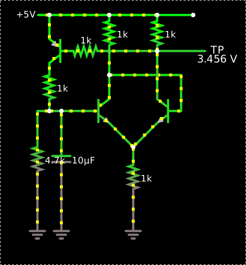
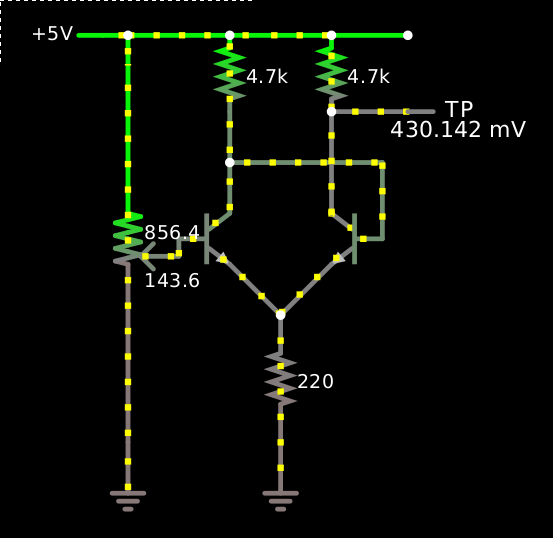
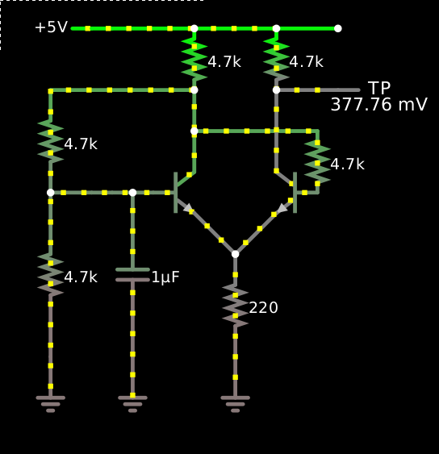
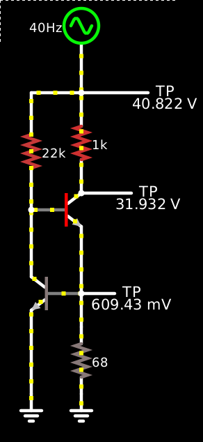
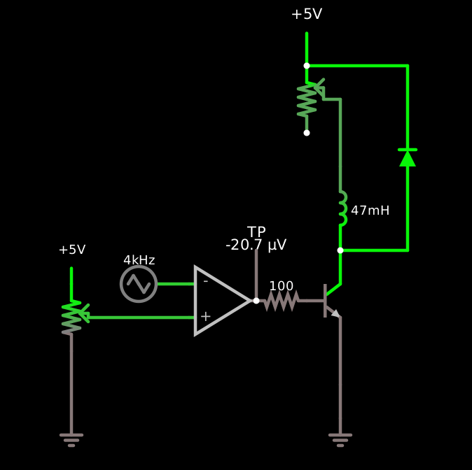
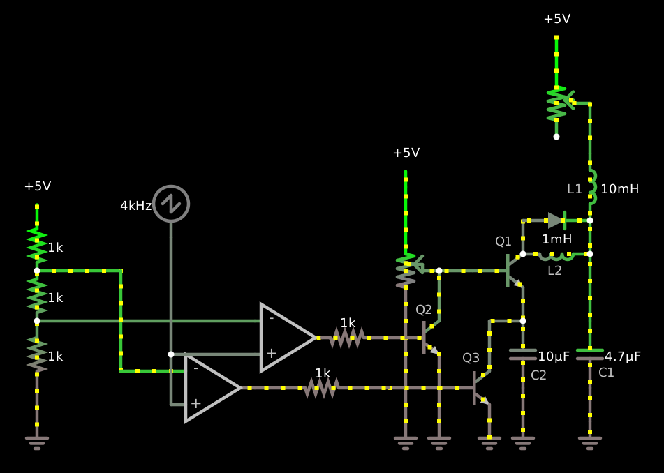

[This Schmitt trigger is a relaxation
oscillator](https://tinyurl.com/yy8p2ox8):

    $ 1 0.000005 10.20027730826997 50 5 43
    t 128 176 176 176 0 1 -0.2938307156093387 0.33934606572308645 100
    t 272 176 240 176 0 1 0.5930756260039916 0.6331767813324252 100
    w 176 192 208 224 0
    w 240 192 208 224 0
    r 208 224 208 304 0 1000
    g 208 304 208 336 0 0
    w 176 160 176 128 0
    w 176 128 272 128 0
    w 272 128 272 176 0
    w 240 160 240 96 0
    w 176 128 176 96 0
    r 176 96 176 48 0 1000
    r 240 96 240 48 0 1000
    w 176 48 128 48 0
    w 176 48 240 48 0
    w 240 48 288 48 0
    R 96 48 64 48 0 0 40 5 0 0 0.5
    w 240 96 288 96 0
    368 288 96 320 96 0 0
    w 240 96 160 96 0
    t 128 96 96 96 0 -1 -0.5925597349297167 -0.6239301896520031 100
    w 96 48 96 80 0
    w 96 48 128 48 0
    r 96 112 96 176 0 1000
    c 96 176 96 304 0 0.00001 3.7550188699753013 0.001
    g 96 304 96 336 0 0
    w 96 176 128 176 0
    r 160 96 128 96 0 1000
    r 64 176 64 304 0 4700
    g 64 304 64 336 0 0
    w 64 176 96 176 0
    o 18 64 0 36875 10 6.4 0 2 18 3
    o 24 64 0 4355 5 0.003125 1 2 24 3

It oscillates at about 33 Hz with a 31% duty cycle.

The wire from the differential amplifier’s negative output to its
negative input provides the positive feedback that makes it a Schmitt
trigger, a configuration which I got from the introductory transistor
chapter of Horowitz & Hill, so the transistors in the pair are nearly
always either in saturation or cutoff.  When the left transistor (the
positive input) is in saturation, the right one is in cutoff, and so
the PNP switch at the top is also in saturation, so the capacitor
discharges until the positive-input transistor goes into cutoff, the
negative input goes into saturation, and so does the PNP switch, so
the capacitor starts charging.

When the positive output is high, the voltage down from the positive
power supply to the positive output is nearly 0; the simulation has up
to about 50 pA of leakage current through that transistor, so up to
about 50 nV of drop through its 1kΩ collector resistor.  This keeps
the PNP transistor firmly off, allowing the 10μF timing capacitor to
discharge through the 4.7 kΩ resistor at a milliamp or two.  (It’s
also bled by the input impedance of the positive input of the
differential pair, but only about 30 μA goes that way.)

So we have a discharge time constant of about 47 ms, discharging down
from about 4 V (where does this number come from?) toward zero to
2.9 V, at which point it’s crossed the 1.1 volts of hysteresis and the
Schmitt trigger fires.  2.9 ÷ 4.0 = 0.725, whose natural log is -0.3,
so this should be about 0.3 time constants, or about 15 ms, but in the
simulation it’s more like 9 ms, so I must be analyzing something
wrong.  The discharge current drops from about 2.4 mA to about 0.6 mA
during this time, which suggests it’s about 1.4 time constants.  So
I’m analyzing both the asymptotic value and the time constant wrong.

When the output snaps low, down to about 3.5 volts (where does this
number come from?), this is enough to draw about 0.9 milliamps through
the PNP transistor’s base resistor, driving it into saturation and
charging the capacitor from the 1kΩ–4.7kΩ divider.  (We can ignore the
30–40 mV of saturated-transistor voltage drop.)

The Thévenin equivalent of the voltage divider is a source of 4.1 V (5
× 4.7/(1 + 4.7)) with a short-circuit current of 5 mA, and thus a
source impedance of about 800 Ω, the parallel combination of the 1 kΩ
and 4.7 kΩ, so we’d expect the charging time constant to be about
8 ms.  (The cutoff base contributes even less here, just -0.1 pA or so
of diode leakage.)  The 1.1 volts from 2.9 to 4.0 volts should be
about 11/12 of the total distance, leaving 1/12, which should take
about 2.5 time constants, or about 20 ms.

So I’m totally confused about everything.  But the circuit does
oscillate!

Where does the 3.5 volts come from?  It must be 1.5 mA through the
collector resistor, which also goes through the shared emitter
resistor along with another 0.9 mA from the PNP switch’s base current
(1.5 V - 0.6 V of Vbe on a 1 kΩ resistor) and the positive-feedback
current into the base of the negative-input transistor, which is about
another 0.9 mA.  This all adds up to about 3.4 mA and thus 3.4 V in
the emitter resistor to ground, plus another 40 mV of Vce.  So it’s
basically the voltage divider between the collector resistor and the
emitter resistor, perturbed by the additional base currents.

The base current on the negative-input transistor is so large because
it’s only limited by the positive-input transistor’s collector
resistor.  As long as β > 2.5 we could get by with a smaller base
current.  Similarly we only demand about β > 2.2 on the PNP switch and
about β > 1.2 on the other transistor of the differential pair.  We
could introduce a 10-kΩ resistor on all three bases without changing
the circuit’s behavior radically, though it does speed up the
oscillation and bring the duty cycle close to ½ and reduce the
hysteresis from about 1.1 V to about 0.6 V; and the output is then
close to 2.9–3.1 V instead of 3.5.  It also increases the amount of
time the positive-input transistor is in forward-active mode and
consequently makes the circuit behavior dependent on its β, although
I’m not sure why.

Trying to get higher gain out of the Schmitt trigger
----------------------------------------------------

If we use larger collector resistors, or a smaller emitter resistor,
the output voltage swing will be larger, though at the expense of
lower input impedance.  For example, with 4.7-kΩ collector resistors
and a 220-Ω emitter resistor, the output voltage can go down to
430 mV, though with an input impedance of just over 220 Ω, only about
200 mV of hysteresis, and a threshold around 800 mV.  Then maybe we
can get by without the PNP switch for the oscillator?  The idea is
that when the positive input transistor switches off, its collector
gets pulled high, and the capacitor on its input starts to charge from
there.  Here’s the [Schmitt trigger driven from a
pot](https://tinyurl.com/y4to2cxt):

    $ 1 0.000005 1.3241202019156522 60 5 43
    t 144 176 176 176 0 1 -0.30258918619292474 0.3178213755193918 100
    t 272 176 240 176 0 1 0.5904473435832114 0.6204105617123166 100
    w 176 192 208 224 0
    w 240 192 208 224 0
    r 208 224 208 304 0 220.00000000000003
    g 208 304 208 336 0 0
    w 176 128 272 128 0
    w 240 160 240 96 0
    w 176 128 176 96 0
    r 176 96 176 48 0 4700
    r 240 96 240 48 0 4700
    w 176 48 112 48 0
    w 176 48 240 48 0
    w 240 48 288 48 0
    R 96 48 64 48 0 0 40 5 0 0 0.5
    w 240 96 288 96 0
    368 288 96 320 96 0 0
    w 96 48 112 48 0
    g 112 304 112 336 0 0
    w 272 128 272 176 0
    w 176 128 176 160 0
    174 112 304 144 64 1 1000 0.1436 Resistance
    o 16 64 0 36875 10 12.8 0 2 16 3
    o 4 64 0 4355 2.5 0.0125 1 2 4 3

At one point, the input voltage is 964 mV and Ib is 601 mA; at 1.113 V
Ib is 1.254 mA, thus about 228 Ω for a change of 653 μA over 149 mV;
and at 1.204 V Ib is 1.659 mA, so a further 91 mV gives a further
405 μA, giving 224 Ω.  So the input impedance is just over that of the
emitter resistor, because the majority of the emitter current here is
base current, and the collector current is almost constant.  Moving
the input 100 mV higher will move the resistor’s voltage almost 100 mV
higher, and thus its current as well.  So for example at 1090 mV input
the base current is 1.149 mA, the emitter is at 464 mV, the collector
is at 491 mV, and the emitter resistor is carrying 2.109 mA from those
464 mV, of which the other 0.960 mA come from the collector resistor
at 4.509 V.  But if I bump up the input to 1113 mV (23 mV higher), the
base current goes up to 1.254 mA (as said above, and that’s 0.105 mA
more), the emitter voltage up to 486 mV (22 mV higher), and the
collector voltage up to 512 mV (21 mV higher).  This diminishes the
current through the collector resistor to 0.955 mA (0.005 mA less), so
now the emitter resistor is carrying 2.209 mA, 0.100 mA more.

Can we make the Schmitt trigger oscillate without the extra transistor switch?
------------------------------------------------------------------------------

So if we rig up an unbuffered capacitor on the input like before, it’s
going to be pulled down by this 220-Ω input impedance whenever the
left-hand transistor is conducting, so it’s going to burn down pretty
fast.  But the feedback output is only going to be able to supply a
milliamp or so.

You might think to rely on just the 220-Ω input impedance to discharge
the capacitor, then charging it through a simple resistive pullup, but
that won’t work — the impedance approaches infinity as you get close
to the threshold, so the cap discharges close to the threshold but
never crosses it, bringing the differential pair into perfect
equilibrium.

[Further efforts in this direction have not proven
fruitful](https://tinyurl.com/y5cy3ln3):

    $ 1 0.000005 1.3241202019156522 60 5 43
    t 144 176 176 176 0 1 -0.9040533288840188 0.5648973225760063 100
    t 272 176 240 176 0 1 0.5498868952546583 0.6028520852394035 100
    w 176 192 208 224 0
    w 240 192 208 224 0
    r 208 224 208 304 0 220.00000000000003
    g 208 304 208 336 0 0
    w 176 128 272 128 0
    w 240 160 240 96 0
    w 176 128 176 96 0
    r 176 96 176 48 0 4700
    r 240 96 240 48 0 4700
    w 176 48 112 48 0
    w 176 48 240 48 0
    w 240 48 288 48 0
    R 96 48 64 48 0 0 40 5 0 0 0.5
    w 240 96 288 96 0
    368 288 96 320 96 0 0
    w 96 48 112 48 0
    g 128 304 128 336 0 0
    w 176 128 176 160 0
    c 128 176 128 304 0 0.000001 0.889692304649781 0.001
    w 128 176 144 176 0
    w 128 176 112 176 0
    w 112 176 96 176 0
    r 64 176 64 304 0 4700
    w 96 176 64 176 0
    g 64 304 64 336 0 0
    r 272 128 272 176 0 4700
    w 176 96 64 96 0
    r 64 96 64 176 0 4700
    o 16 64 0 36875 2.5 1.6 0 2 16 3
    o 4 64 0 4355 1.25 0.00625 1 2 4 3
    o 20 64 0 4099 2.5 0.0015625 2 2 20 3

Tweaking this like a mindless monkey, I can’t seem to get it to
actually oscillate.  Try as I might, the capacitor just finds a
tranquil equilibrium point.  I think what’s happening is that a single
RC circuit isn’t sufficient to create enough phase shift to get this
amplifier to oscillate: I need unity gain or better at 180°, and a
single capacitor only gets me a 90° phase shift.  But I don’t
understand that stuff at all, so I might be talking total nonsense
here.  You’d think that you could get 180° of phase shift just by
using the negative output!

A linear constant-current source
--------------------------------

I was thinking that I could make a constant-current source by
connecting the output of a simple Schmitt-trigger oscillator like
these to some kind of switching transistor, a sense resistor, and some
kind of LC filter or something.  A very simple non-switching
constant-current source, based on what I think is a very widely used
design, [looks like this](https://is.gd/dumbampreg):

    $ 13 0.000005 10.20027730826997 50 5 43
    t 256 160 304 160 0 1 -26.012675061853923 0.65192506786543 100
    t 304 240 256 240 0 1 -0.65192506786543 0.6059774622652498 100
    w 256 160 256 224 0
    w 304 176 304 240 0
    w 304 240 304 272 0
    r 304 272 304 336 0 68
    w 256 256 256 336 0
    g 256 336 256 352 0 0
    g 304 336 304 352 0 0
    r 304 48 304 144 0 1000
    R 304 48 304 -16 0 1 40 20 30 0 0.5
    r 256 160 256 48 0 22000
    w 256 48 304 48 0
    368 304 144 368 144 0 0
    368 304 48 384 48 0 0
    368 304 240 352 240 0 0
    o 9 64 0 4099 10 0.0125 0 2 9 3
    o 14 64 0 4099 80 51.2 1 6 14 3 13 0 13 3 15 0 15 3

In this simulation, the input voltage across the 1-kΩ load varies
between +10 V and +50 V.  The load is grounded through the collector
of the pass transistor, whose emitter has a 68-Ω sense resistor to
ground, which in parallel with the base-emitter junction of a feedback
transistor.  The collector of the feedback transistor robs current
from the base of the pass transistor, which is pulled up to the source
with a 22-kΩ resistor.  So the feedback transistor maintains the sense
resistor at 600 mV or so (570–620 mV in the simulation) by reducing
its collector current whenever its base voltage starts to drop, which
allows the base voltage on the pass transistor to soar.

The upshot is that the load current is held constant within about ±5%
despite 5× variations in the input voltage, but the pass transistor
burns 2× as much power as the load on average, 4× at peak.

Regulating current efficiently with PWM
---------------------------------------

What I was thinking was that if you could feed the pass transistor a
PWM signal, then filter its collector with an LC filter, you could
regulate the load current without dissipating all that power.  I can’t
figure out how to connect a constant-current LC filter to a transistor
without either blowing up the transistor with a voltage spike when it
turns off, or blowing it up with a current spike when it turns on, so
for the moment [I’m trying to make do with a
diode](https://tinyurl.com/y5m4df72):

    $ 1 0.000005 0.28339363076941687 50 5 43
    t 304 272 336 272 0 1 -5.2088354545247935 -0.000020699986477813047 100
    w 336 288 336 352 0
    w 336 352 336 384 0
    g 336 384 336 400 0 0
    a 192 272 256 272 8 5 0 1000000 3.3999999647789307 3.1930000000000005 100000
    R 304 48 304 0 0 0 40 5 0 0 0.5
    174 304 48 304 112 0 100 0.1337 load
    w 320 80 336 80 0
    w 336 80 336 144 0
    l 336 144 336 224 0 0.047 0.21955359875043728
    w 336 224 400 224 0
    34 power-schottky 1 0.0001714352819281 0 1.1281915331325552 0 5
    d 400 224 400 48 2 power-schottky
    w 400 48 304 48 0
    w 336 224 336 256 0
    174 80 320 96 272 0 1000 0.6386000000000001 current setting
    g 80 320 80 400 0 0
    w 96 288 192 288 0
    R 192 256 144 256 0 3 4000 2.5 2.5 0 0.5
    R 80 256 80 224 0 0 40 5 0 0 0.5
    r 256 272 304 272 0 100
    368 256 272 256 208 0 0
    o 9 2 0 4099 5 0.4 0 2 9 3
    o 20 2 0 4098 10 6.4 1 2 20 3

The comparator in this circuit compares the current input setting to a
triangle wave, thus generating a PWM waveform to use to switch a power
transistor between saturation and cutoff.  The collector of the power
transistor grounds one end of the inductor some of the time, while
otherwise allowing it to return to the positive voltage supply through
the Schottky diode.

Thus analyzed, this is just an ordinary buck converter drawn in a
slightly weird way, and its variable-current output isn’t really a
current output at all; with a constant PWM duty cycle and supply
voltage, it will give you a constant *voltage*, not a constant
current.  To avoid unboundedly increasing current, the inductor’s
time-averaged voltage must be zero (ignoring parasitic resistance) so
the average voltages at its two ends must be equal.  But that wasn’t
what we wanted; we wanted to set a *current* and have the sink produce
that current.

A Rube Goldberg linear current sink
-----------------------------------

Now, we could achieve that with feedback, as suggested earlier: adjust
the duty cycle of an oscillator according to a current for example as
indicated by the voltage across a sense resistor.  But is there an
inherently regulated way?

Well, a capacitor does have the property that its time-averaged
current is zero, but by itself that doesn’t give you what you want.
But you could reasonably charge a capacitor up to a desired voltage
and then dump it to ground at a variable frequency in order to get a
frequency-to-current converter, or [charge it up to a variable voltage
and then dump it to ground at a fixed
frequency](https://tinyurl.com/y2eeqydu):

This circuit does not really work.  The idea here is that L1 and C1
smooth the current from the load, while Q1 allows C2 to charge up to
some variable voltage, set by the potentiometer.  Then, at some fixed
frequency (4 kHz here), Q2 pulls Q1’s base to ground, turning it off,
and then Q3 shorts C2 to ground.  If the potentiometer is at, say,
900 mV, then Q1 will allow C2 to charge to 300 mV, thus accumulating
3 μC of charge, and so at 4 kHz this circuit should sink 12 mA for a
wide range of load impedances. L2 and its flyback diode are intended
to limit the current with which C2 charges, so that when Q2 turns off
and Q1 turns back on, Q1’s collector current isn’t excessive.  The two
comparators, the sawtooth, and the voltage divider handle the
sequencing of Q2 and Q3.

And all of that sort of works in the simulation.  The regulation isn’t
perfect: there’s ripple, there’s ringing, there’s a lot of overshoot,
and it can even reverse the voltage to the load (which would often be
a fatal flaw in real life), but the real problem is what happens at
Q3.  Because it’s trying to short out a charged capacitor, it has to
dissipate all the energy in the capacitor — whatever base current you
give it will never be enough for it to start out in saturation,
because an ideal capacitor can supply infinite current.

So this is really just a Rube Goldberg variable linear current sink,
similar to the two-transistor one given earlier, except that it’s
burning up the wasted energy in pulses instead of continuously.  And
that’s the big sense in which it doesn’t really work.

Essentially the problem is that, if this current sink is connected
between the load and ground, and its load terminal is at +3 V dc from
ground, and it’s sinking an average of 12 mA dc, then it’s receiving
48 mW of energy through that terminal.  That energy has to go
somewhere; it can’t just disappear.

A slightly less broken Rube Goldberg switching current source?
--------------------------------------------------------------

This suggests a straightforward way to solve the problem: instead of
trying to sink current from the load, let’s source current to the load
via Q3!  This has the problem that, when we try to dump C2 into the
load via Q3, we aren’t dumping a known amount of charge; we’re only
discharging C2 down to the voltage of the load’s input terminal.  I
tried some things here but I’m not confident that it works at all; I
think it may just have fooled me:

    $ 1 0.000005 18.278915558614752 40 5 43
    R 272 144 272 96 0 0 40 15 0 0 0.5
    174 496 272 496 336 0 100 0.8564 load
    w 512 304 528 304 0
    w 528 304 528 368 0
    174 160 320 176 176 0 1000 0.08420000000000001 current setting
    g 160 320 160 400 0 0
    R 160 160 160 128 0 0 40 15 0 0 0.5
    t 224 240 272 240 0 1 -14.954239010668287 -3.889054598302753 100
    w 272 224 272 192 0
    d 272 192 272 144 2 default
    c 272 288 272 352 0 0.00001 3.9348155877184956 0.001
    g 272 352 272 400 0 0
    w 192 240 176 240 0
    w 192 240 192 288 0
    t 128 304 192 304 0 1 0.631950629878116 0.6777116192938586 100
    w 224 240 192 240 0
    w 272 256 272 288 0
    w 272 288 240 288 0
    w 240 288 240 336 0
    t 144 352 240 352 0 1 -3.937246095539954 0.558406250396508 100
    g 528 368 528 400 0 0
    a 16 304 80 304 8 5 0 1000000 1.6666666666666667 2.8000000408304526 100000
    a -64 352 16 352 8 15 0 1000000 3.3333333333333335 2.8000000408304526 100000
    g 192 320 192 400 0 0
    r 128 304 80 304 0 1000
    r 144 352 16 352 0 1000
    R -192 192 -192 160 0 0 40 5 0 0 0.5
    r -192 192 -192 240 0 1000
    r -192 240 -192 288 0 1000
    r -192 288 -192 352 0 1000
    g -192 352 -192 400 0 0
    w -192 288 16 288 0
    w -192 240 -112 240 0
    w -112 240 -112 336 0
    w -112 336 -64 336 0
    R -64 208 -64 176 0 4 4000 2.5 2.5 0 0.5
    w -64 208 -64 320 0
    w -64 320 16 320 0
    w -64 320 -64 368 0
    l 496 208 496 272 0 0.1 0.00900069879531614
    x 245 216 262 219 4 12 Q1
    x 214 327 231 330 4 12 Q3
    x 169 281 186 284 4 12 Q2
    x 279 344 295 347 4 12 C2
    x 266 166 281 169 4 12 L1
    w 240 368 416 368 0
    w 416 368 416 208 0
    l 288 144 288 192 0 0.01 1.0027900861914286e-13
    w 416 208 496 208 0
    w 496 208 576 208 0
    w 528 368 576 368 0
    d 576 368 576 208 2 default
    w 272 192 288 192 0
    w 288 144 272 144 0
    o 14 1 2 4099 5 0.1 0 3 19 2 7 2
    o 3 2 0 4097 5 0.1 1 2 3 3

An approach that will definitely work: PWM with feedback
--------------------------------------------------------

Returning to the previous PWM circuit, it should be straightforward to
make it regulate current rather than voltage by adding negative
feedback.

Here’s [a messy version](https://tinyurl.com/y3sm6c7m):

    $ 1 0.0000049999999999999996 0.28339363076941687 50 15 43
    t 304 272 336 272 0 1 0.6260511746778811 0.674755596023026 100
    g 336 384 336 400 0 0
    a 192 272 256 272 8 5 0 1000000 3.800000004678905 4.126251457841372 100000
    R 304 48 304 0 0 0 40 15 0 0 0.5
    174 304 48 304 112 0 1000 0.8267000000000001 load
    w 320 80 336 80 0
    w 336 80 336 144 0
    w 336 224 336 256 0
    w 96 288 192 288 0
    R 192 256 144 256 0 3 4000 2.5 2.5 0 0.5
    r 256 272 304 272 0 1000
    368 256 272 256 208 0 0
    r 336 320 336 384 0 47
    w 336 288 336 320 0
    a 96 336 0 336 9 5 0 1000000 0.8613930098335231 0.8614248813748869 100000
    w 0 336 0 384 0
    w 96 352 96 384 0
    r 96 384 0 384 0 2700
    r 96 384 96 432 0 1000
    g 96 432 96 448 0 0
    R -336 -32 -336 -48 0 0 40 5 0 0 0.5
    174 -336 64 -304 -16 1 1000 0.5 Current setting
    g -336 64 -336 80 0 0
    w -304 16 -80 16 0
    r 96 320 336 320 0 1000
    r -80 16 96 16 0 1000
    c 96 16 160 16 0 1e-7 2.500000000000011 0.001
    g 160 16 160 48 0 0
    w 304 48 384 48 0
    d 384 224 384 48 2 default
    w 384 224 336 224 0
    l 336 144 336 224 0 0.22000000000000003 0.014864165387393801
    d -64 336 -128 336 2 default
    c -128 336 -128 432 0 0.000001 2.534996346391612 0.001
    g -128 432 -128 448 0 0
    w -128 336 -160 336 0
    r -160 336 -160 432 0 1000
    g -160 432 -160 448 0 0
    r 0 336 -64 336 0 33
    a -64 176 -208 176 9 5 0 1000000 2.534996346391612 2.500000000000011 100000
    w 96 16 96 80 0
    w 96 80 48 80 0
    w 48 160 -64 160 0
    w -128 336 -128 256 0
    w -128 256 -64 256 0
    w -64 256 -64 192 0
    w 48 80 48 160 0
    r -208 176 -208 272 0 1000
    c -208 272 -208 320 0 0.000001 4.126251457841372 0.001
    g -208 320 -208 352 0 0
    w -208 272 96 272 0
    w 96 272 96 288 0
    o 11 2 0 36866 10 6.4 0 2 11 3
    o 31 2 0 4099 20 0.1 1 2 31 3
    o 15 2 0 4098 10 0.00625 2 2 15 3
    o 33 2 0 4099 5 0.0125 3 2 33 3

I struggled a lot to get this to work, battling lots of unexplained
convergence problems, and hopefully I can do a better version later.

When the switching transistor is on, it passes the current through the
47-ohm sense resistor, which converts each milliamp into 47 mV.  The
first op-amp multiplies that by 3.7 to get 173.9 mV/mA, and then a
peak-detector diode lops about 520 mV off of that.  So 18 mA gives you
3.1 volts at the output of the opamp, and 2.58 volts at the output of
the diode.  (The inrush-limiting 33-Ω resistor adds an additional
error, about 130 mV in this case.)  The peak-detecting capacitor is
discharged to ground with a 1-ms time constant, so the 250-μs period
of the 4-kHz PWM signal is enough for about a 22% decay in the worst
case of a very low duty cycle, so on average the voltage here is
about, say, 8% lower than the peak.  So our 2.4 volts or so goes to
the opamp above to be compared with the set point from the
potentiometer, and this comparison is also filtered with a 1-ms-τ RC
filter.  The duty cycle with which the ripply input signal falls below
the set point is then fairly directly used as the duty cycle for the
comparator with the sawtooth.

This does overshoot and ring, and it has residual error, but it
doesn’t work nearly as badly as it sounds like it ought to.  I wanted
to wedge an error integrator in there somewhere in order to eliminate
the residual error, but I kept getting convergence failures in the
solver.

Another problem with this circuit is that the base current on the
switching transistor is included in the current measurement.  This is
a big problem at low duty cycles; in the example circuit, with the
load set at 114 Ω, we achieve about 7–9 mA through the load at about
an 8% duty cycle.  But when the switching transistor is turned on with
a 5-V signal, there’s another 3.8 mA of base current which gets added,
so the sense resistor actually measures 11.5 mA.  Turning the load up
to 668 Ω, the duty cycle stabilizes around 30%, with 8.2 mA through
the sense resistor, so we have about 29% residual error due to
proportional control — but the current through the actual load is only
about 4 mA, more like a 50% error!

This base-current error could be corrected either by running the sense
resistor on the opposite side of the load from the switching
transistor, by putting the sense resistor between the load and the
switching transistor (which would probably require differential
measurement), or by reducing the base current when operating the load
at low currents.

(And of course the ultimate objective is to simplify the whole circuit
to about seven transistors by using the oscillators presented at the
top of this note, feeding them some kind of signal to modify their
duty cycle, produced through the kind of PI control I totally failed
to achieve in this case.)
