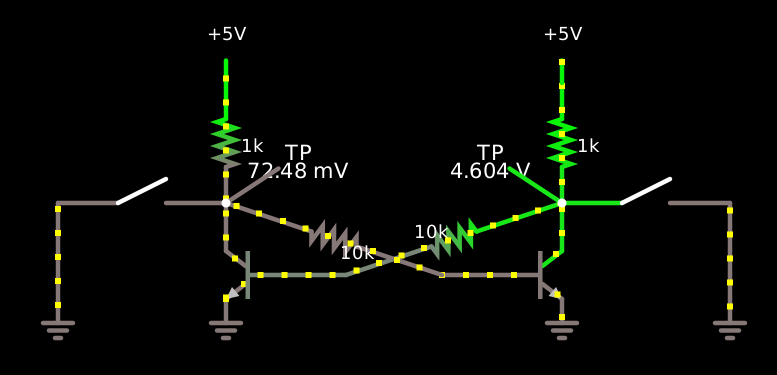

I was thinking about building logic out of discrete transistors and
other such basic parts.

JLCPCB assembly pricing
-----------------------

This is in part driven by JiaLiChuang’s PCB assembly service (see file
`pick-and-place.md`).  They charge you I think 1.43¢ per PNP
transistor, 1.32¢ per NPN transistor, 1.68¢ per N-MOSFET, and 1.79¢
per P-MOSFET, including assembly and soldering, but only 0.35¢ per
0402 resistor or 0.50¢ per 0805 resistor.  So a standard CMOS
two-input NAND built out of discrete power MOSFETs would be 6.94¢,
while a standard RTL two-input NAND would be only 3.69¢, and also use
a lot less space.

But can we do better?  They only charge you 1.08¢ for a 1N4148W
(again, including assembly).  The LGP-30 CPU used 113 vacuum tubes and
1450 diodes; the tubes were set up as latches (“flip-flops”) whose set
and reset inputs were computed via diode logic.  If the vacuum tubes
could be replaced by MOSFETs, assembling these parts would cost
US$17.56, of which US$1.90 would be the transistors.

The two-NPN RTL latch
---------------------

Consider the [traditional two-NPN RTL latch][0].  Both NPN transistors
have their emitters grounded, base resistors of 10kΩ to the collector
of the other transistor, and collector pullups of 1kΩ to Vcc.

    $ 1 0.000005 0.8031194996067259 50 5 43 5e-11
    t 160 240 80 240 0 1 0.5676806399704408 0.6401601810026045 100 default
    t 224 240 304 240 0 1 -4.531171328470282 0.07247958718181605 100 default
    g 304 256 304 272 0 0
    g 80 256 80 272 0 0
    r 160 240 304 192 0 10000
    r 224 240 80 192 0 10000
    w 80 192 80 224 0
    w 304 192 304 224 0
    r 80 192 80 112 0 1000
    r 304 192 304 112 0 1000
    R 304 112 304 80 0 0 40 5 0 0 0.5
    R 80 112 80 80 0 0 40 5 0 0 0.5
    s 304 192 416 192 0 1 true
    g 416 192 416 272 0 0
    s -32 192 80 192 0 1 true
    g -32 192 -32 272 0 0
    368 80 192 128 160 0 0
    368 304 192 256 160 0 0
    o 16 64 0 4099 5 6.4 0 2 16 3
    o 17 64 0 4099 5 6.4 0 2 17 3

[0]: https://tinyurl.com/yz8xzdjw

Like RTL in general, this sinks current fairly strongly, but sources
it fairly weakly.  If β = 100 and Vcc = 5 V, the base current is (5 V
- 600 mV) / 11kΩ = 400 μA, the transistor on the LOW side of the latch
can sink 40 mA while remaining in saturation, but only sinks 5 mA in
normal operation.  You can flip the latch over by overwhelming it in
either direction.  By sourcing enough current into its LOW side you
can pull it up to HIGH and knock the other side LOW, but this requires
about 35 mA (a number which would push it up to 35 V if not restrained
by the limited compliance of a current source).  By contrast, sinking
current from its HIGH side can flip it over with only about 3.9 mA,
pushing the collector down by 3.9 V and leaving only 5 - 3.9 - .6 =
0.5 volts across the other transistor’s base resistor, and thus only
50 μA of base current, at which point it desaturates and its Vce
starts to soar, flipping the latch back.

This asymmetry is computationally promising: the latch can pull its
inputs/outputs down to 0.2 volts sinking 40 mA, but pulling the other
output down to 1.1 volts by sinking 3.9 mA is enough to flip the
latch’s state.  There’s [more than a diode drop’s worth of
headroom][1] in there and a fanout of about 10, and of course the
latch itself provides amplification and inversion:

[1]: https://tinyurl.com/yg4mujb6

    $ 1 0.000005 0.8031194996067259 50 5 43 5e-11
    t 160 240 80 240 0 1 -4.531171328470283 0.07247958718181524 100 default
    t 224 240 304 240 0 1 0.5676806399704415 0.6401601810026044 100 default
    g 304 256 304 272 0 0
    g 80 256 80 272 0 0
    r 160 240 304 192 0 10000
    r 224 240 80 192 0 10000
    w 80 192 80 224 0
    w 304 192 304 224 0
    r 80 192 80 112 0 1000
    r 304 192 304 112 0 1000
    R 304 112 304 80 0 0 40 5 0 0 0.5
    R 80 112 80 80 0 0 40 5 0 0 0.5
    s 304 192 416 192 0 1 true
    g 416 192 416 272 0 0
    s -32 192 80 192 0 1 true
    g -32 192 -32 272 0 0
    368 80 192 128 160 0 0
    368 304 192 256 160 0 0
    368 800 192 752 160 0 0
    368 576 192 624 160 0 0
    g 464 192 464 272 0 0
    s 464 192 576 192 0 1 true
    g 912 192 912 272 0 0
    s 800 192 912 192 0 1 true
    R 576 112 576 80 0 0 40 5 0 0 0.5
    R 800 112 800 80 0 0 40 5 0 0 0.5
    r 800 192 800 112 0 1000
    r 576 192 576 112 0 1000
    w 800 192 800 224 0
    w 576 192 576 224 0
    r 720 240 576 192 0 10000
    r 656 240 800 192 0 10000
    g 576 256 576 272 0 0
    g 800 256 800 272 0 0
    t 720 240 800 240 0 1 -4.53117132847028 0.07247958718181717 100 default
    t 656 240 576 240 0 1 0.56768063997044 0.6401601810026043 100 default
    w 304 192 320 208 0
    w 544 208 576 192 0
    d 544 208 320 208 2 default
    s 80 192 16 128 0 1 true
    R 16 128 16 96 0 0 40 5 0 0 0.5
    o 16 64 0 4099 5 6.4 0 2 16 3
    o 17 64 0 4099 5 6.4 0 2 17 3
    o 19 64 0 4099 5 6.4 0 2 19 3
    o 18 64 0 4099 5 6.4 0 2 18 3

So by [coupling some such latches together with diodes][2] you can
compute, among other things, arbitrary logic functions; by releasing a
/S signal at some given time you can see whether any of the various
sources connected through diodes to its /R input were low at the time,
thus computing their AND (in conventional positive logic) and putting
their NAND on the /S line at that time.

[2]: https://is.gd/2latch

(The same asymmetry also means you can get 3-stable and 4-stable
latches rather than just bistable ones.)

The three-phase thing
---------------------

Something I think is more interesting is what happens when you power
the latch from a clock signal instead of a constant positive voltage
rail.  Say the clock signal controls some kind of high-side switch
like a PNP transistor; then when the switch is turned off both inputs
are basically just 10kΩ to ground (+0.6V at currents above the most
minimal) and 2kΩ to each other.  The same switch can be shared between
probably multiple gates.

If you divide your gates into three phases, you can activate each
phase during a different three sixths of a single complete clock cyle:

    CK0  CK1  CK2
     *
     *    *
          *
          *    *
               *
     *         *

In this way, gates in phase 1 can compute results from gates in phase
0, gates in phase 2 can compute results from gates in phase 1, and
gates in phase 0 can compute results from gates in phase 2.

But how do you ensure a determinate outcome?  As before you could
release a /R input at a given point during the clock cycle,
lengthening the full set of stages within the clock cycle from 6 to 9:

    E0 R0 E1 R1 E2 R2
    ** **
    **       **
    **    ** **
    **    **
          **       **
          **    ** **
          **    **
       **       **
    ** **       **

