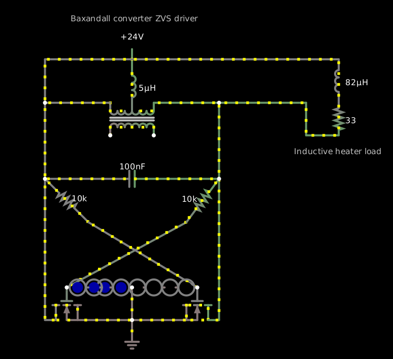

I tried simulating a [Baxandall converter][0] ZVS driver circuit [with
circuit.js][1]; here's the circuit:

[0]: https://adammunich.com/zvs-driver/
[1]: http://www.falstad.com/circuit/circuitjs.html?ctz=CQAgjOCmC0DsICYB0BOBCAsCAcBmW2YCuGKGuIArAAzjW3kBQANopQGwjsZudhEha1JPWqVBIhJTDZsCMBgztcMsPnaMw7FIkzh2tdD34JBE0fRRXrN2zojYkssAQxgUsekUoIYWrkgqsES4lMEk+LDi7IFYKi7YlNjU2hwSVowAxuA4ujy42DxGZmAw8NAYwrDV2FHUmJQ0GJQ8wl6MAO452Hnd4ALUnX0mvSODXTg9IwXGA0MzvQvkpoMASrxcRWn+QiCViK1mwpSMAGYgoaYLl3u4V6ZgSOJtCGf6tAtaDHd7tI-PkiGLk4yw2oPGYJ+uFwIJ+gwA5pDTFIQdwjvN2D1QUs4fNCot8WMgYpbg9cuCgeSfkQesVBgAPfScaA9UIUaDiYymABCAEN6byAHYAE15zGYAB0AM6ZAD2goAbpAAE4AFxV0oAWgA1ADK0uFyoAlkrlUMURd8RaKV0vpb8jDELJBIxlRdHZN7b0-hZXX1iu5kc6faIgWgnayfF7BiQQKcOobZQAHCUAR1wSAeIBQgV80H45iwVECHHYBB8KGw7HYLh0f007Cu1HyVtgVytcYTyuTaYzKxKEjAjFj8cTKfTmegWZzdz8EDaRcoJer5YQlertZKDeR1FZVr0C1Mo+7477U6O4EH2-A4cPu69R67PYnCHPu3nSCHWnuH3xuGbD6dmOvaTv2fxXt+FxRtcCC-kUQEniBr5gZewhfo2iBtg+aSHghz59heH7ociB5WjhHbHvhoGERBGF2p8t4UU+p7Ue+V6yog+hmNIxAXLBVCPP2yIXIwQA

    $ 1 1e-7 2.9224283781234943 50 100 43
    l 256 64 256 112 0 0.0005 0.025188214463181376
    169 224 160 224 112 0 0.000009999999999999999 1 8.881784197001252e-16 6.317123571343775 6.342311785806956 0.99
    c 128 224 384 224 0 1e-7 -40.777875024550454 0.001
    w 128 224 128 112 0
    w 128 112 224 112 0
    w 288 112 384 112 0
    w 384 224 384 432 0
    R 256 64 256 16 0 0 40 24 0 0 0.5
    f 352 384 352 432 32 1.5 0.02
    f 160 384 160 432 40 1.5 0.02
    w 176 432 256 432 0
    w 256 432 336 432 0
    g 256 432 256 464 0 0
    w 368 432 384 432 0
    w 384 224 384 112 0
    w 144 432 128 432 0
    w 128 432 128 224 0
    x 166 -8 353 -5 4 12 Baxandall\sconverter\sZVS\sdriver
    w 256 384 256 432 0
    w 160 384 336 288 0
    r 336 288 384 224 0 10000
    r 128 224 192 288 0 10000
    w 192 288 352 384 0
    34 fwdrop\q3.2 1 9.32e-11 0.042 5.356678529866179 0 1
    162 304 384 272 384 2 fwdrop\q3.2 0 0 1 0.1
    34 fwdrop\q3.2-2 1 9.32e-11 0.042 5.356678529866179 0 1
    162 208 384 224 384 2 fwdrop\q3.2-2 0 0 1 0.1
    162 192 384 208 384 2 fwdrop\q3.2-2 0 0 1 0.1
    162 320 384 304 384 2 fwdrop\q3.2-2 0 0 1 0.1
    162 352 384 320 384 2 fwdrop\q3.2-2 0 0 1 0.1
    162 272 384 256 384 2 fwdrop\q3.2 0 0 1 0.1
    162 224 384 256 384 2 fwdrop\q3.2-2 0 0 1 0.1
    162 160 384 192 384 2 fwdrop\q3.2-2 0 0 1 0.1
    o 2 16 0 5123 320 51.2 0 2 2 3

By itself this produces a somewhat disappointing peak voltage
multiplication of about 3×, or 6× peak to peak, with a resonant peak
about 158 kHz on the FFT, which is high enough for inductive heating
of even non-ferrous metals in some cases.  The two strings of four
3.2-volt blue LEDs limit the gate voltages on the two N-channel
MOSFETs to about 9.9 volts (2.4 volts per LED, which is a bit
unrealistic...) so they don't burn out, while the 10k resistors limit
the current through the LEDs to about 5 mA.

The resonant frequency is of course 1/(2π√(LC)), and in this case the
relevant L is the 10 μH of the inductor, and the C is the 0.1 μF of
the capacitor, 159.1 kHz, which is right.  The peak current in the
tank circuit is about 7.5 amps, 1500 times the current through the
LEDs.

If I load the output (parallel to the capacitor) with a resistive
load, then somewhere below about 180 Ω, the output collapses.  For it
to recover, the load evidently needs to be 330 Ω or more.  It’s
possible to use an inductive load of 82 μH with 33 Ω equivalent series
resistance and [have it work][2]:

[2]: https://tinyurl.com/y5xtv9us

    $ 1 1e-7 2.3728258192205156 50 100 43
    l 256 64 256 112 0 0.0000049999999999999996 1.3758031682752978
    169 224 160 224 112 0 0.000009999999999999999 1 0 -4.784632558596629 -3.4088293903213227 0.99
    c 128 224 384 224 0 1e-7 33.040933721242446 0.001
    w 128 224 128 112 0
    w 128 112 224 112 0
    w 288 112 384 112 0
    w 384 224 384 432 0
    R 256 64 256 16 0 0 40 24 0 0 0.5
    f 352 384 352 432 32 1.5 0.02
    f 160 384 160 432 40 1.5 0.02
    w 176 432 256 432 0
    w 256 432 336 432 0
    g 256 432 256 464 0 0
    w 368 432 384 432 0
    w 384 224 384 112 0
    w 144 432 128 432 0
    w 128 432 128 224 0
    x 166 -8 353 -5 4 12 Baxandall\sconverter\sZVS\sdriver
    w 256 384 256 432 0
    w 160 384 336 288 0
    r 336 288 384 224 0 10000
    r 128 224 192 288 0 10000
    w 192 288 352 384 0
    34 fwdrop\q3.2-2 1 9.32e-11 0.042 5.9498493010683156 0 0.1
    162 208 384 224 384 2 fwdrop\q3.2-2 0 0 1 0.01
    162 192 384 208 384 2 fwdrop\q3.2-2 0 0 1 0.01
    162 320 384 304 384 2 fwdrop\q3.2-2 0 0 1 0.01
    162 352 384 320 384 2 fwdrop\q3.2-2 0 0 1 0.01
    162 224 384 256 384 2 fwdrop\q3.2-2 0 0 1 0.01
    162 160 384 192 384 2 fwdrop\q3.2-2 0 0 1 0.01
    162 304 384 272 384 2 fwdrop\q3.2-2 0 0 1 0.01
    162 272 384 256 384 2 fwdrop\q3.2-2 0 0 1 0.01
    w 128 112 128 48 0
    w 128 48 560 48 0
    w 384 112 512 112 0
    r 560 112 560 160 0 33
    w 512 112 512 160 0
    w 512 160 560 160 0
    l 560 112 560 48 0 0.000082 0.3059284467964981
    x 494 188 623 191 4 12 Inductive\sheater\sload
    o 2 16 0 5123 80 6.4 0 2 2 3

The original [Baxandall converer circuit][3] is by Peter Baxandall
from 1959.

[3]: http://www.sophia-electronica.com/Baxandall_parallel-resonant_Class-D_oscillator1.htm
